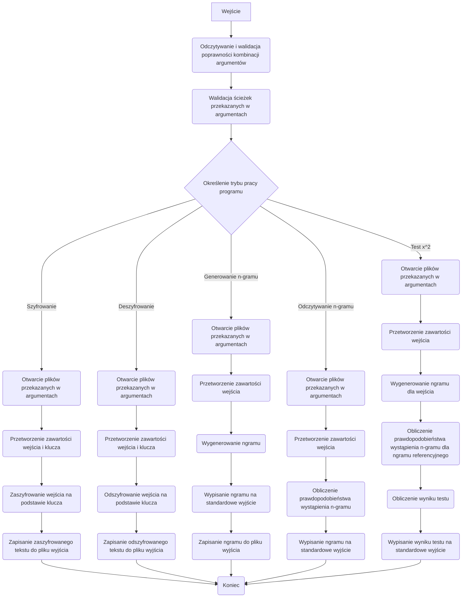

# Kryptografia i kryptoanaliza

## Laboratorium 2

### Grupa 1ID24B

### Autorzy: Jakub Babiarski, Jan Chojnacki

### Baza projektu
```Rust
//! Główna aplikacja CLI kierująca wywołaniami do poszczególnych modułów kryptograficznych.

mod algorithms;
mod args;
mod attack;
mod file_handling;
mod operations;
mod ngram;

use crate::algorithms::*;
use crate::args::{
    AlgorithmCommand, Args, AttackAlgorithmCommand, AttackArgs, AttackCommand, Commands,
    NgramCommand,
};
use crate::attack::*;
use clap::Parser;

/// Punkt wejścia programu odpowiedzialny za sparsowanie argumentów i delegowanie
/// wykonania do odpowiednich modułów implementujących algorytmy, operacje i ataki.
///
/// # Działanie
/// * Korzysta z `clap` do odczytania poleceń przekazanych wierszem poleceń.
/// * Na podstawie otrzymanego podpolecenia wywołuje funkcję obsługującą dany tryb
///   pracy (szyfrowanie, deszyfrowanie, analizy n-gramowe bądź ataki).
/// * Każdy wariant polecenia przekazuje dalej odpowiednie argumenty, dzięki czemu
///   logika biznesowa pozostaje odseparowana od warstwy CLI.
fn main() {
    let args = Args::parse();

    // Dopasowanie wariantu polecenia przekierowujące wykonanie do odpowiedniego modułu.
    match args.commands {
        Commands::Encrypt { algorithm_command } => match algorithm_command {
            AlgorithmCommand::Substitution { input, output, key } => {
                substitution::handle_encrypt(input, output, key);
            }
            AlgorithmCommand::Transposition { input, output, key } => {
                transposition::handle_encrypt(input, output, key);
            }
            AlgorithmCommand::Affine {
                input,
                output,
                a,
                b,
            } => {
                affine::handle_encrypt(input, output, a, b);
            }
        },
        Commands::Decrypt { algorithm_command } => match algorithm_command {
            AlgorithmCommand::Substitution { input, output, key } => {
                substitution::handle_decrypt(input, output, key);
            }
            AlgorithmCommand::Transposition { input, output, key } => {
                transposition::handle_decrypt(input, output, key);
            }
            AlgorithmCommand::Affine {
                input,
                output,
                a,
                b,
            } => {
                affine::handle_decrypt(input, output, a, b);
            }
        },
        Commands::Ngram { ngram_command } => match ngram_command {
            NgramCommand::Generate { g, input, file } => {
                operations::handle_ngram_generate(input, file, g);
            }
            NgramCommand::Read { r, file } => {
                operations::handle_ngram_read(file, r);
            }
        },
        Commands::Attack { attack_command } => match attack_command {
            AttackCommand::BruteForce { algorithm } => match algorithm {
                AttackAlgorithmCommand::Transposition { args } => {
                    let AttackArgs {
                        input,
                        output,
                        file,
                        r,
                    } = args;
                    bruteforce::transposition::handle_attack(input, output, file, r);
                }
                AttackAlgorithmCommand::Affine { args } => {
                    let AttackArgs {
                        input,
                        output,
                        file,
                        r,
                    } = args;
                    bruteforce::affine::handle_attack(input, output, file, r);
                }
            },
        },
        Commands::Similarity { r, input, file } => {
            operations::handle_x2test(input, file, r);
        }
    }
}

```
Działanie funkcji ```main.rs``` opiera się na wykorzystaniu ```match```, która działa analogicznie do słowa kluczowego ```switch``` wykorzystywanego w np. w języku c. Funkcja odczytuje argument podany przy wywołaniu programu i dopasowuje go przy pomocy struktury ```args{}``` do pasującego typu enumerate.  Funkcja nie przyjmuje argumentów oraz nie zwraca żadnych wartości.

Kod źródłowy struktury ```Args{}```. Struktura przechowuje informacje o opcjach wybranych przy uruchamianiu aplikacji. pole commands jest weryfikowane przez typ enumerate, który będzie bliżej opisany podczas omawiania zadań laboratoryjnych.
```Rust
pub struct Args {
   /// Główne polecenie wybierające tryb pracy narzędzia.
   #[command(subcommand)]
   pub commands: Commands,
}
```
### Zadanie 1

Napisz program w języku ```RUST``` implementujący algorytm szyfru przesuwnego (szyfr Cezara).

1. Tekst jawny powinien być importowany do programu z pliku tekstowego, którego nazwa określona powinna być
   po zdefiniowanym argumencie / fladze: -i.
2. Wynik pracy programu powinien być eksportowany do pliku tekstowego, którego nazwa określona powinna być
   po zdefiniowanym argumencie / fladze: -o.
3. Klucz powinien być określany za pomocą parametru / flagi -k.
4. Tryb pracy programu powinien być określony poprzez flagi: -e dla procesu szyfrowania, -d dla procesu deszy-
   frowania.

#### Implementacja

Fragment kodu źródłowego funkcji ```main.rs``` odpowiedzialnej za szyfrowanie przesuwne.


```Rust
fn main() {
    let args = Args::parse();

    // Dopasowanie wariantu polecenia przekierowujące wykonanie do odpowiedniego modułu.
    match args.commands {
        Commands::Encrypt { algorithm_command } => match algorithm_command {
            AlgorithmCommand::Transposition { input, output, key } => {
                transposition::handle_encrypt::handle_encrypt(input, output, key);
            }
        }
    }
}
```

```rust
#[derive(Subcommand, Debug)]
pub enum AlgorithmCommand {
   Transposition {
      /// Plik z tekstem jawnym lub zaszyfrowanym.
      #[arg(short, long)]
      input: PathBuf,
      /// Plik wyjściowy na wynik szyfrowania bądź deszyfrowania.
      #[arg(short, long)]
      output: PathBuf,
      /// Przesunięcie klucza w zakresie od 1 do 25.
      #[arg(short, long, value_parser = clap::value_parser!(u8).range(1..=25))]
      key: u8,
   },
}
```

Zasada działania typu enumerate jest identyczna jak przy laboratorium 1. Metoda match porównuje argumenty podane przy wywołaniu programu z zawartością typu enumerate i na tej podstawie podejmuje decyzje które części kodu wykonać.
Poniżej przedstawiono kod funkcji ```handle_encrypt``` wywoływanej przy wybraniu opcji szyfru przestawiennego.
```rust
pub fn handle_encrypt(input: PathBuf, output: PathBuf, key: u8) {
   let input = open_input(input).expect("Failed to open input file");
   let output = open_output(output).expect("Failed to open output file");

   let input = input_parser(input);

   let key = generate_transposition_key(key as i16);

   let buf: String = substitute(&input, &key);

   save_to_file(&buf, output);
}
```
Funkcja przyjmuje w argumencie ścieżkę do pliku wejściowego i wyjściowego oraz wartość oznaczającą klucz. W pierwszej kolejności otwierane są pliki, następnie przygotowywany jest plik wejściowy
za pomocą funkcji ```input_parser``` wykorzystywanej przy porzednim laboratorium. Kolejno generowany jest klucz przy pomocy ```generate_transposition_key```. Na końcu nastęþuje wywołanie funkcji ```substitute``` dokonującej zamiany znaków oraz zapisanie wyniku do pliku wyjściowego.

Kod źródłowy funkcji ```generate_transposition_key``` wywoływanej przez funkcję ```handle_encrypt```.
```rust
pub fn generate_transposition_key(n: i16) -> HashMap<char, char> {
    let mut key = HashMap::with_capacity(26);
    let shift: u8 = ((n + 26) % 26) as u8;

    for i in 0..26 {
        let from = (b'A' + i) as char;
        let to = (b'A' + ((i + shift) % 26)) as char;
        key.insert(from, to);
    }

    key
}
```

Funkcja przyjmuje w argumencie klucz podany przy wywołaniu programu. W pierwszej kolejności tworzy 26 elementową mapę znaków, następnie obliczane jest przesunięcie.
Kolejno wykonywane jest oblicznie nowego alfabetu z uwzględnieniem przesunięcia oraz dodanie go do mapy, którą funkcja zwraca.
#### Wyniki

W tej sekcji powinny być przedstawione wyniki pracy programu

``` sh

head -c 100 ./plaintext/alice_wonderland.txt 
THEPROJECTGUTENBERGEBOOKOFALICESADVENTURESINWONDERLANDTHISEBOOKISFORTHEUSEOFANYONEANYWHEREINTHEUNITE

head -c 100 ./ciphertext/alice.txt 
WKHSURMHFWJXWHQEHUJHERRNRIDOLFHVDGYHQWXUHVLQZRQGHUODQGWKLVHERRNLVIRUWKHXVHRIDQBRQHDQBZKHUHLQWKHXQLWH
```


### Zadanie 2

Rozbuduj program z poprzedniego zadania poprzez implementację ataku typu brute-force na szyfrogram wygenero-
wany przy pomocy algorytmu przesuwnego.

#### Implementacja
Fragment kodu funkcji ```main.rs``` obsługujący symulację ataku typu BruteForce na szyfrowanie przestawienne.
```Rust
fn main(){
   let args = Args::parse();

   // Dopasowanie wariantu polecenia przekierowujące wykonanie do odpowiedniego modułu.
   match args.commands {
       Commands::Attack { attack_command } => match attack_command {
           AttackCommand::BruteForce { algorithm } => match algorithm {
               AttackAlgorithmCommand::Transposition { args } => {
                   let AttackArgs {
                       input,
                       output,
                       file,
                       r,
                   } = args;
                   bruteforce::transposition::handle_attack(input, output, file, r);
               }
           }
       }
   }
}
```
Wywołuje funkcję ```handle_attack```, która w argumencie przyjmuje ścieżkę do pliku wejściowego, wyjściowego, zawierającego n-gramy oraz wartość określająca wielkość wykorzystanego n-gramu.
W pierwszej kolejności funkcja przygotowuje plik wejściowy oraz plik z-gramem poprzez otwarcie ich, oraz usunięciu niepotrzebnych znaków za pomocą funkcji z odpiskiem ```parser```
Następnie 

#### Wyniki

W tej sekcji powinny być przedstawione wyniki pracy programu

```shell

./target/debug/Cryptography-and-cryptanalysis at br tr -i ./ciphertext/alice.txt -o ./plaintext/alice_wonderland.txt -r 3 ./n-grams/english_trigrams.txt 
Failed to find key.
best_key=3, best_x2=125110.842260518

./target/debug/Cryptography-and-cryptanalysis at br tr -i ./ciphertext/alice.txt -o ./plaintext/alice_wonderland.txt -r 3 ./n-grams/alice_trigrams.txt 
key=3
```

### Zadanie 3

Napisz program analogiczny do programu z zadania 1, który tym razem implementuje szyfr afiniczny.

#### Implementacja

```Rust
fn main(){
    
}
```

Kod źródłowy powinien być podzielony na części (definicje i funkcje). Każdy fragment programu powinien być opisany:

- co jest wejściem funkcji
- co jest wyjściem funkcji
- co implementuje dana funkcja

#### Wyniki

W tej sekcji powinny być przedstawione wyniki pracy programu

``` sh
RESULT
```

### Zadanie 4

Rozbuduj program z poprzedniego zadania poprzez implementację ataku typu brute-force na szyfrogram zaim-
plementowany przy pomocy szyfru afinicznego. Sposób pracy z programem powinien być analogiczny do pracy z
programem z zadania 2.

#### Implementacja

```Rust
fn main(){
    
}
```

Kod źródłowy powinien być podzielony na części (definicje i funkcje). Każdy fragment programu powinien być opisany:

- co jest wejściem funkcji
- co jest wyjściem funkcji
- co implementuje dana funkcja

#### Wyniki

W tej sekcji powinny być przedstawione wyniki pracy programu

``` sh
RESULT
```