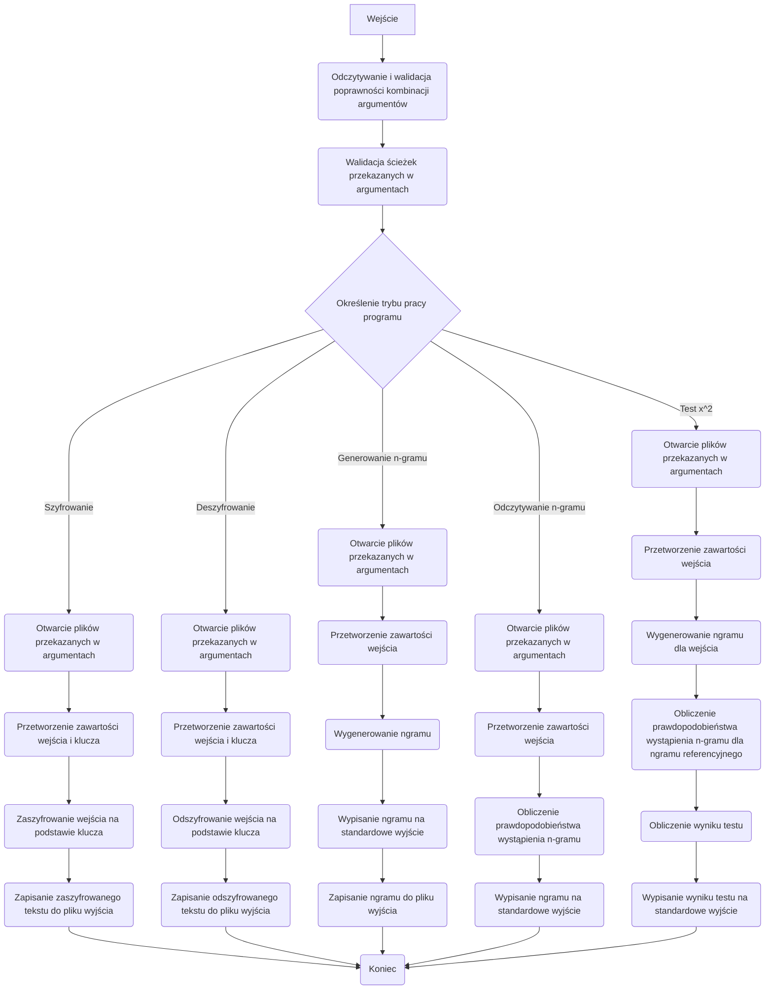

# Kryptografia i kryptoanaliza

## Laboratorium 2

### Grupa 1ID24B

### Autorzy: Jakub Babiarski, Jan Chojnacki

### Baza projektu
```Rust
//! Główna aplikacja CLI kierująca wywołaniami do poszczególnych modułów kryptograficznych.

mod algorithms;
mod args;
mod attack;
mod file_handling;
mod operations;
mod ngram;

use crate::algorithms::*;
use crate::args::{
    AlgorithmCommand, Args, AttackAlgorithmCommand, AttackArgs, AttackCommand, Commands,
    NgramCommand,
};
use crate::attack::*;
use clap::Parser;

/// Punkt wejścia programu odpowiedzialny za sparsowanie argumentów i delegowanie
/// wykonania do odpowiednich modułów implementujących algorytmy, operacje i ataki.
///
/// # Działanie
/// * Korzysta z `clap` do odczytania poleceń przekazanych wierszem poleceń.
/// * Na podstawie otrzymanego podpolecenia wywołuje funkcję obsługującą dany tryb
///   pracy (szyfrowanie, deszyfrowanie, analizy n-gramowe bądź ataki).
/// * Każdy wariant polecenia przekazuje dalej odpowiednie argumenty, dzięki czemu
///   logika biznesowa pozostaje odseparowana od warstwy CLI.
fn main() {
    let args = Args::parse();

    // Dopasowanie wariantu polecenia przekierowujące wykonanie do odpowiedniego modułu.
    match args.commands {
        Commands::Encrypt { algorithm_command } => match algorithm_command {
            AlgorithmCommand::Substitution { input, output, key } => {
                substitution::handle_encrypt(input, output, key);
            }
            AlgorithmCommand::Transposition { input, output, key } => {
                transposition::handle_encrypt(input, output, key);
            }
            AlgorithmCommand::Affine {
                input,
                output,
                a,
                b,
            } => {
                affine::handle_encrypt(input, output, a, b);
            }
        },
        Commands::Decrypt { algorithm_command } => match algorithm_command {
            AlgorithmCommand::Substitution { input, output, key } => {
                substitution::handle_decrypt(input, output, key);
            }
            AlgorithmCommand::Transposition { input, output, key } => {
                transposition::handle_decrypt(input, output, key);
            }
            AlgorithmCommand::Affine {
                input,
                output,
                a,
                b,
            } => {
                affine::handle_decrypt(input, output, a, b);
            }
        },
        Commands::Ngram { ngram_command } => match ngram_command {
            NgramCommand::Generate { g, input, file } => {
                operations::handle_ngram_generate(input, file, g);
            }
            NgramCommand::Read { r, file } => {
                operations::handle_ngram_read(file, r);
            }
        },
        Commands::Attack { attack_command } => match attack_command {
            AttackCommand::BruteForce { algorithm } => match algorithm {
                AttackAlgorithmCommand::Transposition { args } => {
                    let AttackArgs {
                        input,
                        output,
                        file,
                        r,
                    } = args;
                    bruteforce::transposition::handle_attack(input, output, file, r);
                }
                AttackAlgorithmCommand::Affine { args } => {
                    let AttackArgs {
                        input,
                        output,
                        file,
                        r,
                    } = args;
                    bruteforce::affine::handle_attack(input, output, file, r);
                }
            },
        },
        Commands::Similarity { r, input, file } => {
            operations::handle_x2test(input, file, r);
        }
    }
}

```
Działanie funkcji ```main.rs``` opiera się na wykorzystaniu ```match```, która działa analogicznie do słowa kluczowego ```switch``` wykorzystywanego w np. w języku c. Funkcja odczytuje argument podany przy wywołaniu programu i dopasowuje go przy pomocy struktury ```args{}``` do pasującego typu enumerate.  Funkcja nie przyjmuje argumentów oraz nie zwraca żadnych wartości.

Kod źródłowy struktury ```Args{}```. Struktura przechowuje informacje o opcjach wybranych przy uruchamianiu aplikacji. pole commands jest weryfikowane przez typ enumerate, który będzie bliżej opisany podczas omawiania zadań laboratoryjnych.
```Rust
pub struct Args {
   /// Główne polecenie wybierające tryb pracy narzędzia.
   #[command(subcommand)]
   pub commands: Commands,
}
```
### Zadanie 1

Napisz program w języku ```RUST``` implementujący algorytm szyfru przesuwnego (szyfr Cezara).

1. Tekst jawny powinien być importowany do programu z pliku tekstowego, którego nazwa określona powinna być
   po zdefiniowanym argumencie / fladze: -i.
2. Wynik pracy programu powinien być eksportowany do pliku tekstowego, którego nazwa określona powinna być
   po zdefiniowanym argumencie / fladze: -o.
3. Klucz powinien być określany za pomocą parametru / flagi -k.
4. Tryb pracy programu powinien być określony poprzez flagi: -e dla procesu szyfrowania, -d dla procesu deszy-
   frowania.

#### Implementacja

Fragment kodu źródłowego funkcji ```main.rs``` odpowiedzialnej za szyfrowanie przesuwne.


```Rust
fn main() {
    let args = Args::parse();

    // Dopasowanie wariantu polecenia przekierowujące wykonanie do odpowiedniego modułu.
    match args.commands {
        Commands::Encrypt { algorithm_command } => match algorithm_command {
            AlgorithmCommand::Transposition { input, output, key } => {
                transposition::handle_encrypt::handle_encrypt(input, output, key);
            }
        }
    }
}
```

```rust
#[derive(Subcommand, Debug)]
pub enum AlgorithmCommand {
   Transposition {
      /// Plik z tekstem jawnym lub zaszyfrowanym.
      #[arg(short, long)]
      input: PathBuf,
      /// Plik wyjściowy na wynik szyfrowania bądź deszyfrowania.
      #[arg(short, long)]
      output: PathBuf,
      /// Przesunięcie klucza w zakresie od 1 do 25.
      #[arg(short, long, value_parser = clap::value_parser!(u8).range(1..=25))]
      key: u8,
   },
}
```

Zasada działania typu enumerate jest identyczna jak przy laboratorium 1. Metoda match porównuje argumenty podane przy wywołaniu programu z zawartością typu enumerate i na tej podstawie podejmuje decyzje które części kodu wykonać.
Poniżej przedstawiono kod funkcji ```/transpostition/handle_encrypt``` wywoływanej przy wybraniu opcji szyfru przestawiennego.
```rust
pub fn handle_encrypt(input: PathBuf, output: PathBuf, key: u8) {
   let input = open_input(input).expect("Failed to open input file");
   let output = open_output(output).expect("Failed to open output file");

   let input = input_parser(input);

   let key = generate_transposition_key(key as i16);

   let buf: String = substitute(&input, &key);

   save_to_file(&buf, output);
}
```
Funkcja przyjmuje w argumencie ścieżkę do pliku wejściowego i wyjściowego oraz wartość oznaczającą klucz. W pierwszej kolejności otwierane są pliki, następnie przygotowywany jest plik wejściowy
za pomocą funkcji ```input_parser``` wykorzystywanej przy porzednim laboratorium. Kolejno generowany jest klucz przy pomocy ```generate_transposition_key```. Na końcu nastęþuje wywołanie funkcji ```substitute``` dokonującej zamiany znaków oraz zapisanie wyniku do pliku wyjściowego.

Kod źródłowy funkcji ```generate_transposition_key``` wywoływanej przez funkcję ```handle_encrypt```.
```rust
pub fn generate_transposition_key(n: i16) -> HashMap<char, char> {
    let mut key = HashMap::with_capacity(26);
    let shift: u8 = ((n + 26) % 26) as u8;

    for i in 0..26 {
        let from = (b'A' + i) as char;
        let to = (b'A' + ((i + shift) % 26)) as char;
        key.insert(from, to);
    }

    key
}
```

Funkcja przyjmuje w argumencie klucz podany przy wywołaniu programu. W pierwszej kolejności tworzy 26 elementową mapę znaków, następnie obliczane jest przesunięcie.
Kolejno wykonywane jest oblicznie nowego alfabetu z uwzględnieniem przesunięcia oraz dodanie go do mapy, którą funkcja zwraca.
#### Wyniki

W tej sekcji powinny być przedstawione wyniki pracy programu

``` sh

head -c 100 ./plaintext/alice_wonderland.txt 
THEPROJECTGUTENBERGEBOOKOFALICESADVENTURESINWONDERLANDTHISEBOOKISFORTHEUSEOFANYONEANYWHEREINTHEUNITE

head -c 100 ./ciphertext/alice.txt 
WKHSURMHFWJXWHQEHUJHERRNRIDOLFHVDGYHQWXUHVLQZRQGHUODQGWKLVHERRNLVIRUWKHXVHRIDQBRQHDQBZKHUHLQWKHXQLWH
```


### Zadanie 2

Rozbuduj program z poprzedniego zadania poprzez implementację ataku typu brute-force na szyfrogram wygenero-
wany przy pomocy algorytmu przesuwnego.

#### Implementacja
Fragment kodu funkcji ```main.rs``` obsługujący symulację ataku typu BruteForce na szyfrowanie przestawienne.
```Rust
fn main(){
   let args = Args::parse();

   // Dopasowanie wariantu polecenia przekierowujące wykonanie do odpowiedniego modułu.
   match args.commands {
       Commands::Attack { attack_command } => match attack_command {
           AttackCommand::BruteForce { algorithm } => match algorithm {
               AttackAlgorithmCommand::Transposition { args } => {
                   let AttackArgs {
                       input,
                       output,
                       file,
                       r,
                   } = args;
                   bruteforce::transposition::handle_attack(input, output, file, r);
               }
           }
       }
   }
}
```
Wywołuje funkcję ```handle_attack```, która w argumencie przyjmuje ścieżkę do pliku wejściowego, wyjściowego, zawierającego n-gramy oraz wartość określająca wielkość wykorzystanego n-gramu.
W pierwszej kolejności funkcja przygotowuje plik wejściowy oraz plik z-gramem poprzez otwarcie ich, oraz usunięciu niepotrzebnych znaków za pomocą funkcji z odpiskiem ```parser```
Następnie obliczana jest liczba stopni swobody i ustawiana jest wartość krytyczna. Koejno jest wywoływana funkcja attack. Na końcu wynik jest zapisywany do pliku wyjściowego.

Kod źródłowy funkcji ```handle_attack```.
```rust
pub fn handle_attack(input: PathBuf, output: PathBuf, ngram_ref: PathBuf, r: u8) {
    let input = open_input(input).expect("Failed to open input file");
    let input = input_parser(input);

    let ngram_ref = open_ngram(ngram_ref).expect("Failed to open ngram file");
    let ngram_ref = ngram_parser(ngram_ref, r);

    let df = 26.0f64.powi(r as i32) - 1.0;
    let p = 0.95f64;

    let buf = attack(input, ngram_ref, df, p, r);
    let output = open_output(output).expect("Failed to open output file");
    save_to_file(&buf, output);
}
```

Funkcja ```attack``` odpowiada za główną logikę działania aplikacji przy przeprowadzaniu ataków łamiących szyfrowanie. Poniżej zaprezentowano jej kod.
```rust
fn attack(input: String, ngram_ref: HashMap<String, f64>, df: f64, p: f64, r: u8) -> String {
    let ngram = ngram_generator(&input, r);
    let n = ngram.len() as f64;
    let ngram_ref = ngram_ref.iter().map(|(k, v)| (k.clone(), v * n)).collect();

    let chi = ChiSquared::new(df).expect("invalid degrees of freedom");
    let critical = chi.inverse_cdf(p);

    let results: Mutex<Vec<(u8, f64)>> = Mutex::new(Vec::new());

    // Wektory przesunięć są oceniane równolegle, co skraca czas pełnego przeszukania.
    if let Some((i, decrypted)) = (1u8..=25)
        .into_par_iter()
        .filter_map(|i| {
            let key = generate_transposition_key(-(i as i16));
            let decrypted = substitute(&input, &key);

            let ngram = ngram_generator(&decrypted, r);
            let ngram = histogram_generator(ngram);

            match x2test(&ngram, &ngram_ref, critical) {
                Ok(_) => Some((i, decrypted)),
                Err(x2) => {
                    results.lock().unwrap().push((i, x2));
                    None
                }
            }
        })
        .find_any(|_| true)
    {
        println!("key={}", i);
        return decrypted;
    }

    println!("Failed to find key.");
    let mut results = results.into_inner().unwrap();
    results.sort_by(|a, b| a.1.total_cmp(&b.1));

    let (best_key, best_x2) = results.first().unwrap();
    println!("best_key={}, best_x2={}", best_key, best_x2);
    let key = generate_transposition_key(-(*best_key as i16));
    substitute(&input, &key)
}
```

Funkcja przyjmuje w argumencie łańcuch znaków z pliku wejściowego, mapę zawierającą n-gramy wraz z ilością ich powtórzeń, wartość stopni swobody, poziom istotności oraz wielkość n-gramu.
W pierwszej kolejności wyliczane jest prawdopodobieństwo wystąpienia każdego n-gramu, następnie liczony jest liczony punkt krytycnzy na podstawie poziomu istotności. Dalej tworzony jest mutex
zapisujący wyniki. W dalszej części oceniane są wartości przesunięcia. Jeśli znajdzie się chociaż jedno przesunięcie zwracające wartość ``ok``, program przerywa szukanie i
wypisuje wynik. Jeśli program nie znajdzie idealnego dopasowania to zwróci najlepiej dopasowany wynik, oraz wartość x^2 dla niego.
#### Wyniki


```shell

./target/debug/Cryptography-and-cryptanalysis at br tr -i ./ciphertext/alice.txt -o ./plaintext/alice_wonderland.txt -r 3 ./n-grams/english_trigrams.txt 
Failed to find key.
best_key=3, best_x2=125110.842260518

./target/debug/Cryptography-and-cryptanalysis at br tr -i ./ciphertext/alice.txt -o ./plaintext/alice_wonderland.txt -r 3 ./n-grams/alice_trigrams.txt 
key=3
```

### Zadanie 3

Napisz program analogiczny do programu z zadania 1, który tym razem implementuje szyfr afiniczny.

#### Implementacja

```Rust
fn main() {
    let args = Args::parse();

    // Dopasowanie wariantu polecenia przekierowujące wykonanie do odpowiedniego modułu.
    match args.commands {
        Commands::Decrypt { algorithm_command } => match algorithm_command {
            AlgorithmCommand::Substitution { input, output, key } => {
                substitution::handle_decrypt::handle_decrypt(input, output, key);
            }
            AlgorithmCommand::Transposition { input, output, key } => {
                transposition::handle_decrypt::handle_decrypt(input, output, key);
            }
            AlgorithmCommand::Affine {
                input,
                output,
                a,
                b,
            } => {
                affine::handle_decrypt::handle_decrypt(input, output, a, b);
            }
        },
    }
}
```

Kod źródłowy funkcji ```affine/handle_encrypt``` odpowiedzialnej za szyfrowanie afiniczne.

```rust
pub fn handle_encrypt(input: PathBuf, output: PathBuf, a: u32, b: u32) {
    let input = open_input(input).expect("Failed to open input file");
    let output = open_output(output).expect("Failed to open output file");

    let input = input_parser(input);
    let key = generate_affine_encrypt_key(a, b);

    let buf: String = substitute(&input, &key);

    save_to_file(&buf, output);
}
```
Funkcja w argumencie przyjmuje ścieżkę do pliku wejściowego i wyjściowego oraz wartości a oraz b potrzebne do zaszyfrowania tekstu.
W pierwszej kolejności funkcja przygotowuje pliki, następnie generuje klucz dla szyfrowania afinicznego, dalej podmienia znaki zgodnie z wygenerowanym kluczem.
Na końcu funkcja zapisuje wynik do pliku.
Poniżej przedstawiono działanie funkcji pomocniczej ```generate_affine_encrypt_key```
```rust
pub fn generate_affine_encrypt_key(a: u32, b: u32) -> HashMap<char, char> {
    const M: u32 = 26;

    assert_eq!(
        euclid_u32(a, M),
        1,
        "Parameter `a` must be coprime with 26 (e.g., 1,3,5,7,9,11,15,17,19,21,23,25)."
    );

    let b = b.rem_euclid(M);

    let mut map = HashMap::with_capacity(26);
    for x in 0..M {
        let p = (b'A' + x as u8) as char;
        let y = (a * x + b).rem_euclid(M);
        let c = (b'A' + y as u8) as char;
        map.insert(p, c);
    }
    map
}
```

Funkcja przyjmuje w argumencie dwie wartości podawane przy włączaniu aplikacji. W pierwszej kolejności deklarowana jest stałą ```M``` o wartości 26, następnie
ustawiana jest zasada, że wartość a musi być równa liczbie pierwszej. Kolejno obliczana jest wartość b. Dalej tworzona jest mapa 26 wartości oraz w pętli
nowe wartości klucza są obliczane oraz dodawane do mapy. Na końcu zwracana jest nowo powstała mapa do funkcji.

#### Wyniki


``` sh

./target/debug/Cryptography-and-cryptanalysis e aff -i ./plaintext/alice_wonderland.txt -o ./ciphertext/affineAlice.txt -a 13 -b 5

thread 'main' panicked at src/algorithms/affine/generate_affine_encrypt_key.rs:16:5:
assertion `left == right` failed: Parameter `a` must be coprime with 26 (e.g., 1,3,5,7,9,11,15,17,19,21,23,25).
  left: 13
 right: 1
note: run with `RUST_BACKTRACE=1` environment variable to display a backtrace

./target/debug/Cryptography-and-cryptanalysis e aff -i ./plaintext/alice_wonderland.txt -o ./ciphertext/affineAlice.txt -a 11 -b 5

head -c 100 ./ciphertext/affineAlice.txt 
GEXOKDAXBGTRGXSQXKTXQDDLDIFWPBXVFMCXSGRKXVPSNDSMXKWFSMGEPVXQDDLPVIDKGEXRVXDIFSJDSXFSJNEXKXPSGEXRSPGX
```

### Zadanie 4

Rozbuduj program z poprzedniego zadania poprzez implementację ataku typu brute-force na szyfrogram zaim-
plementowany przy pomocy szyfru afinicznego. Sposób pracy z programem powinien być analogiczny do pracy z
programem z zadania 2.

#### Implementacja

```Rust
fn main(){
   let args = Args::parse();

   // Dopasowanie wariantu polecenia przekierowujące wykonanie do odpowiedniego modułu.
   match args.commands {
       Commands::Attack { attack_command } => match attack_command {
           AttackAlgorithmCommand::Affine { args } => {
               let AttackArgs {
                   input,
                   output,
                   file,
                   r,
               } = args;
               bruteforce::affine::handle_attack(input, output, file, r);
           }
       },
   }
}
```
Kod funkcji ```handle_attack```
````rust
pub fn handle_attack(input: PathBuf, output: PathBuf, ngram_ref: PathBuf, r: u8) {
    let input = open_input(input).expect("Failed to open input file");
    let input = input_parser(input);

    let ngram_ref = open_ngram(ngram_ref).expect("Failed to open ngram file");
    let ngram_ref = ngram_parser(ngram_ref, r);

    let df = 26.0f64.powi(r as i32) - 1.0;
    let p = 0.95f64;

    let buf = attack(input, ngram_ref, df, p, r);
    let output = open_output(output).expect("Failed to open output file");
    save_to_file(&buf, output);
}
````
Funkcja za argumenty przyjmuje ścieżkę do pliku wejściowego i wyjściowego, ścieżkę do n-gramu oraz wielkość n-gramu. W piewszej kolejności otwiera i przygotowuje plik wejściowy oraz plik n-gramu
Następnie olbicza wartość df oraz wartość p. Dalej wywołuje funkcję ```attack```, na końcu otwiera plik wyjściowy oraz zapisuje wynik do pliku.


Kod funkcji ```attack```
```rust
fn attack(input: String, ngram_ref: HashMap<String, f64>, df: f64, p: f64, r: u8) -> String {
    let ngram = ngram_generator(&input, r);
    let n = ngram.len() as f64;
    let ngram_ref = ngram_ref.iter().map(|(k, v)| (k.clone(), v * n)).collect();

    let chi = ChiSquared::new(df).expect("invalid degrees of freedom");
    let critical = chi.inverse_cdf(p);

    const A_SET: [u32; 12] = [1, 3, 5, 7, 9, 11, 15, 17, 19, 21, 23, 25];

    let keyspace: Vec<(u32, u32)> = A_SET
        .iter()
        .copied()
        .flat_map(|a| (0u32..26).map(move |b| (a, b)))
        .collect();

    let results: Mutex<Vec<((u32, u32), f64)>> = Mutex::new(Vec::new());

    // Przeszukiwanie przestrzeni kluczy odbywa się równolegle, aby skrócić czas obliczeń.
    if let Some(((a, b), decrypted)) = keyspace
        .into_par_iter()
        .filter_map(|(a, b)| {
            let key = generate_affine_decrypt_key(a, b);
            let decrypted = substitute(&input, &key);

            let ngram = ngram_generator(&decrypted, r);
            let ngram = histogram_generator(ngram);

            match x2test(&ngram, &ngram_ref, critical) {
                Ok(_) => Some(((a, b), decrypted)),
                Err(x2) => {
                    results.lock().unwrap().push(((a, b), x2));
                    None
                }
            }
        })
        .find_any(|_| true)
    {
        println!("key=(a={}, b={})", a, b);
        return decrypted;
    }

    println!("Failed to find key.");
    let mut results = results.into_inner().unwrap();
    results.sort_by(|a, b| a.1.total_cmp(&b.1));

    let ((best_a, best_b), best_x2) = results.first().expect("keyspace was empty?");
    println!("best_key=(a={}, b={}), best_x2={}", best_a, best_b, best_x2);

    let key = generate_affine_decrypt_key(*best_a, *best_b);
    substitute(&input, &key)
}
```
Funkcja przyjmuje za argumenty łańcuch znaków z pliku wejściowego, mapę zaweirającą informację o n-gramach, wartości df, p oraz wielkość n-gramu.
Na początku funkcja oblicza częstotliwość występowania n-gramów oraz wartość oczekiwaną. Kolejno obliczane są wartości testu x^2 oraz wartość krytyczna. Dalej następuje równoległe przeszukiwanie przestrzeni kluczy i zapisywanie wynikóœ
do wektora opartego na mutexie. Jeśli w przestrzeni znaleziono pasujący klucz program przerywa działanie i wypisuje pasujący klucz. Jednak jeśli nie znajdzie żadnego pasującego wyniku, to
wypisze najbliższą wartość (najmniejszy x^2)

#### Wyniki

W tej sekcji powinny być przedstawione wyniki pracy programu

``` sh

 ./target/debug/Cryptography-and-cryptanalysis a br af -i ./ciphertext/affineAlice.txt -o ./outputfile/aliceaffine.txt -r 2 ./n-grams/english_bigrams.txt 
Failed to find key.
best_key=(a=11, b=5), best_x2=16707.628274996852

 ./target/debug/Cryptography-and-cryptanalysis a br af -i ./ciphertext/affineAlice.txt -o ./outputfile/aliceaffine.txt -r 3 ./n-grams/alice_trigrams.txt 
key=(a=11, b=5)
```

