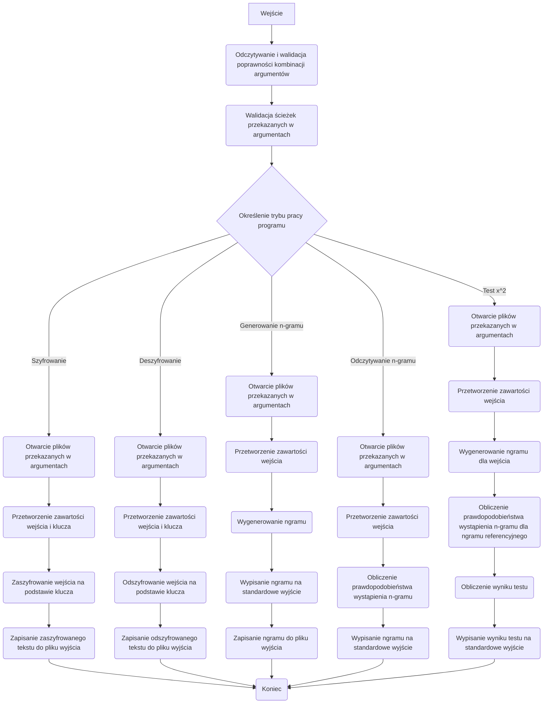

# Kryptografia i kryptoanaliza
## Laboratorium 1
### Grupa 1ID24B
### Autorzy: Jakub Babiarski, Jan Chojnacki



### Zadanie 1

Korzystając z języka Rust, dokonaj implementacji programu szyfrującego i deszyfrującego zadany tekst.
1. Tekst jawny powinien być importowany do programu z pliku tekstowego, którego nazwa określona powinna być
   po zdefiniowanym argumencie / fladze: -i. 
2. Wynik pracy programu powinien być eksportowany do pliku tekstowego, którego nazwa określona powinna być
   po zdefiniowanym argumencie / fladze: -o.
3. Klucz powinien być importowany z pliku tekstowego, którego nazwa powinna być określona po zdefiniowanym
   argumencie / fladze: -k.
4.  Tryb pracy programu powinien być określony poprzez flagi: -e dla procesu szyfrowania, -d dla procesu deszyfrowania
    
#### Implementacja

Kod źródłowy pliku ```main.rs```

```Rust
mod args;
mod converters;
mod file_handling;
mod file_parsers;
mod generators;
mod operating_mode;
mod operations;

use crate::args::Args;
use crate::operating_mode::OperatingMode;
use clap::Parser;

/// Entrypoint that parses CLI arguments, validates them and dispatches the
/// selected operating mode.
fn main() {
    let args = Args::parse();
    args.validate().expect("Validation failed");

    let operating_mode = args.operating_mode();

    match operating_mode {
        OperatingMode::Encryption => {
            operations::encryption_decryption(args, operating_mode);
        }
        OperatingMode::Decryption => {
            operations::encryption_decryption(args, operating_mode);
        }
        OperatingMode::NgramGenerator => {
            operations::ngram_generator(args);
        }
        OperatingMode::NgramReader => {
            operations::ngram_reader(args);
        }
        OperatingMode::X2Test => {
            operations::x2test(args);
        }
    }
}

```

Kod źródłowy pliku ```main.rs``` zawiera jedną funckję ```main()```
- funkcja nie przyjmuje argumentów wejścia
- funkcja nie zwraca żadnych wartości
- funkcja implementuje działanie całego programu zależnie od wybranych przez użytownika flag

Kod źródłowy struktury ```args[]``` i jej implementacji.

```Rust
pub struct Args {
    /// Path to input file.
    #[arg(short, long, value_name = "FILE")]
    pub input: Option<PathBuf>,
    /// Path to output file.
    #[arg(short, long, value_name = "FILE")]
    pub output: Option<PathBuf>,
    /// Path to key file.
    #[arg(short, long, value_name = "FILE")]
    pub key: Option<PathBuf>,
    /// Program operation mode.
    #[clap(flatten)]
    pub mode_group: ModeGroup,

    /// Path to ngram file.
    #[arg(value_name = "FILE", requires = "ngram-file")]
    pub ngram_file: Option<PathBuf>,
}

```
Struktura ```args{}``` przechowuje informacje o plikach, które zostaną wykorzystane w programie. Poniżej znajduje się lista tych pliów:
- Ścieżka do odczytu plku zawierającego tekst jawny lub zaszyfrowany.
- Ścieżka do pliku przechowującego odszyfrowany lub zaszyfrowany tekst.
- Ścieżka do pliku zawierającego klucz szyfrująct.
- Flagę odpowiadającą za wybranie odpowiedniej funckji programu.
```Rust
impl Args {
    /// Performs basic validation of the supplied paths and flags.
    pub fn validate(&self) -> Result<(), String> {
        // Ensure that each path argument uses a supported file extension.
        self.validate_paths()?;

        Ok(())
    }

    /// Determines which operating mode should be executed based on the provided flags.
    pub fn operating_mode(&self) -> OperatingMode {
        // Translate the clap-generated booleans into simple aliases for readability.
        let e = self.mode_group.encrypt;
        let d = self.mode_group.decrypt;
        let n = self.mode_group.gram.is_some();
        let r = self.mode_group.read_ngram.is_some();
        let s = self.mode_group.s;

        // Map the mutually exclusive combinations of flags to their semantic meaning.
        match (e, d, n, r, s) {
            (true, false, false, false, false) => Encryption,
            (false, true, false, false, false) => Decryption,
            (false, false, true, false, false) => NgramGenerator,
            (false, false, false, true, false) => NgramReader,
            (false, false, false, true, true) => X2Test,
            _ => panic!("Impossible combination of flags"),
        }
    }

    /// Validates that every provided path points to a `.txt` file.
    fn validate_paths(&self) -> Result<(), String> {
        if let Some(input) = &self.input {
            if input.extension().and_then(|ext| ext.to_str()) != Some("txt") {
                return Err("Only files with .txt extension are supported.".into());
            }
        }

        if let Some(output) = &self.output {
            if output.extension().and_then(|ext| ext.to_str()) != Some("txt") {
                return Err("Only files with .txt extension are supported.".into());
            }
        }

        if let Some(key) = &self.key {
            if key.extension().and_then(|ext| ext.to_str()) != Some("txt") {
                return Err("Only files with .txt extension are supported.".into());
            }
        }

        Ok(())
    }
}

```
Funkcje zawarte w implementacji args:
1. ```validate()``` i ```validate_paths()```
- Przyjmuje referencję do struktury ```args[]```.
- Zwraca status ok, jeśli nie napotka prolemów lub błąd, jeśli plik nie będzie miał rozszerzenia .txt.
- Funkcja sprawdza, czy wszystkie podane pliki są z rozszerzeniem .txt.

2. ```operating_Mode```
- Pobiera argumenty ze struktury ```ModeGroup{}```.
- Zwraca polecenie, które powinien wywołać program.
- Funckja tłumaczy flagi podane pry wywołaniu programu, tak by funkcja ```main()``` wywołała odpowiednie działania.

Kod źródłowy struktury ```ModeGroup{}```
```Rust
#[derive(clap::Args, Debug)]
pub struct ModeGroup {
    /// Encryption mode.
    #[arg(short, long, requires_all = ["input", "output", "key"])]
    pub encrypt: bool,
    /// Decryption mode.
    #[arg(short, long, requires_all = ["input", "output", "key"])]
    pub decrypt: bool,
    /// Ngram generation mode.
    #[arg(short, long, value_name = "NUMBER", value_parser = clap::value_parser!(u8).range(1..=4), requires_all = ["input"]
    )]
    pub gram: Option<u8>,
    /// Ngram reading mode.
    #[arg(short, long, value_name = "NUMBER", value_parser = clap::value_parser!(u8).range(1..=4))]
    pub read_ngram: Option<u8>,
    /// Generating x^2 test.
    #[arg(short, requires_all = ["read_ngram", "input"])]
    pub s: bool,
}
```

Struktura ```ModeGroup{}``` przechowuje flagi odpowiedzialne za wywoływanie konkretnych działań programu. Jest to struktura pomocnicza dla struktury```args{}```

Kod źródłlwy funkcji ```encrytpion_decryption()```
```Rust
pub fn encryption_decryption(args: Args, operating_mode: OperatingMode) {
    // Extract the required file paths from the parsed arguments.
    let input = args.input.unwrap();
    let output = args.output.unwrap();
    let key = args.key.unwrap();

    // Obtain handles to the plaintext, output and substitution key files.
    let input = open_input(input).expect("Failed to open input file");
    let output = open_output(output).expect("Failed to open output file");
    let key = open_key(key).expect("Failed to open key file");

    // Parse the raw files into their in-memory representations.
    let input = input_parser(input);
    let key = key_parser(key, &operating_mode);

    // Substitute each character according to the key mapping.
    let buf: String = input.chars().map(|x| key.get(&x).unwrap()).collect();

    // Persist the transformed text to the requested destination.
    save_to_file(&buf, output);
}
```
- Funkcja przyjmuje strukturę ```args``` oraz typ enumarate odpowiedzialny za tryb prac programu.
- Funkcja nie zwraca żadnych wartości.
- Funkcja przygotowuje, otwiera i wprowadza do pamięci wymagane pliki, a następnie przy pomocy funkcji ```key_parser``` i ```input_parser```zamienia znaki w pliku zgodnie z podanym kluczem. Na końcu funkcja zapisuje wynik swojej pracy.


Kod źródłowy funkcji ```input_parser```
```Rust
pub fn input_parser(input: File) -> String {
    let reader = BufReader::new(input);
    let mut buf: Vec<String> = Vec::new();

    for line in reader.lines() {
        if let Ok(line) = line {
            // Keep only ASCII alphabetic characters and normalise their case.
            let filtered_string: String =
                line.chars().filter(|c| c.is_ascii_alphabetic()).collect();
            buf.push(filtered_string.to_uppercase())
        }
    }

    buf.join("")
}
```
- Funkcja przyjmuje otwarty plik.
- Funkcja zwraca łańcuch znaków.
- Funkcja przetwarza dane z pliku i zamieina wszystkie litery alfabetu na duże litery.

Kod źródłowy funkcji ```key_parser```
```Rust
pub fn key_parser(key: File, mode: &OperatingMode) -> HashMap<char, char> {
    let mut map: HashMap<char, char> = HashMap::new();
    let reader = BufReader::new(key);

    for line in reader.lines() {
        if let Ok(line) = line {
            let parts: Vec<&str> = line.split_whitespace().collect();
            if parts.len() != 2 {
                panic!("Invalid key format.")
            }
            match mode {
                OperatingMode::Encryption => {
                    // In encryption mode the file lists plaintext to ciphertext pairs.
                    let key = parts[0].chars().next().unwrap();
                    let value = parts[1].chars().next().unwrap();
                    map.insert(key, value);
                }
                OperatingMode::Decryption => {
                    // In decryption mode the mapping is inverted to translate ciphertext back to plaintext.
                    let key = parts[1].chars().next().unwrap();
                    let value = parts[0].chars().next().unwrap();
                    map.insert(key, value);
                }
                _ => {}
            }
        }
    }

    // Validate that all letters are represented once both as keys and values.
    let key_test: HashSet<char> = map.iter().map(|(&k, _)| k).collect();
    let value_test: HashSet<char> = map.iter().map(|(_, &v)| v).collect();

    if key_test.len() != 26 || value_test.len() != 26 {
        panic!("Invalid key values.")
    }

    map
}

```
- Funkcja przymuje jako argumenty otwarty plik klucza oraz tryb pracy.
- Funkcja zwraca mapę wartości zawierającą pary klucz wartość typu char.
- Dla trybu ```Encryption``` funkcja zamienia znaki z otwartego tekstu jawnego na odpowiadające im wartości zgodne z kluczem.
- Dla trybu ```Decryption``` funkcja zamienia znaki z otwartego zaszyfrowanego teksty na odpowiadające im wartości zgodne z kluczem.
#### Wyniki

Przykład działania programu uruchomionego z flagą -e w celu zaszyfrowania danych

```sh

./target/debug/Cryptography-and-cryptanalysis -i alice_wonderland.txt  -k key.txt -o output.txt -e
head -c 100 output.txt
LNFDSCYFWLUMLFAHFSUFHCCRCPQOJWFTQVEFALMSFTJABCAVFSOQAVLNJTFHCCRJTPCSLNFMTFCPQAXCAFQAXBNFSFJALNFMAJLF
```

Przykład działania programu uruchomionego z flagą -e w celu odszyfrowania danych
```shell

./target/debug/Cryptography-and-cryptanalysis -o output2.txt  -k key.txt -i output.txt -d
head -c 100 output2.txt
THEPROJECTGUTENBERGEBOOKOFALICESADVENTURESINWONDERLANDTHISEBOOKISFORTHEUSEOFANYONEANYWHEREINTHEUNITE
```
Program działa bez zarzutów, poprawnie szyfruje oraz deszyfruje tekst. W obu powyższych przypadkach został zastosowany ten sam plik klucza, co dowodzi poprwaności działania programu. Flagi sterujące działaniem programu można umieszczać w dowolnej kolejności, co spełnia założenia projektowe programu.

### Zadanie 2

Rozbudować program z poprzedniego przykładu poprzez dodanie do niego funkcjonalności generowania statystyk licz-
ności występowania n-gramów (sekwencji kolejnych liter), to jest mono-gramów (pojedynczych liter), bi-gramów (wy-
razów dwuliterowych), tri-gramów (wyrazów trzyliterowych) oraz quad-gramów (wyrazów czteroliterowych). Funk-
cjonalność ta powinna być wyzwalana poprzez dodanie do programu jednej z następujących flag: -g1, -g2, -g3 lub
-g4, po której powinna zostać określona nazwa pliku, do którego zapisane zostaną wyniki.

#### Implementacja

Kod źródłowy funkcji ```ngram_generator```

```Rust
pub fn ngram_generator(args: Args) {
    // Gather the input path, output destination and requested n-gram size.
    let input = args.input.unwrap();
    let output = args.ngram_file.unwrap();
    let ngram_size = args.mode_group.gram.unwrap();

    // Read the plaintext input and prepare the output file.
    let input = open_input(input).expect("Failed to open input file");
    let output = open_output(output).expect("Failed to open output file");

    // Normalise the plaintext prior to n-gram extraction.
    let input = input_parser(input);

    // Build the n-gram list, convert it into a histogram and serialise the result.
    let ngram = crate::generators::ngram_generator(&input, ngram_size);
    let histogram = histogram_generator(ngram);
    let buf = ngram_to_string(histogram);

    println!("{buf}");

    // Write the histogram to disk for later use.
    save_to_file(&buf, output);
}
```

- Funkcja przyjmuje w argumencie strukturę ```args{}```.
- Funkcja nie zwraca żadnych wartości.
- Funkcja w pierwszej kolejności przygotowuje dane: odpakowuje je, a następnie otwiera pliki wejścia oraz wyjścia. Kolejno przetwarza otwarty plik funkcją ```input_parser```
tak, żeby zawierał jedynie duże litery alfabetu. Następnie przy pomocy funkcji ```ngram_generator()``` z modułu ```generators``` tworzy histogramy wystąpień n-gramów, przy pomocy funkcji ```hisogram_generator()```. Dalej zapisuje histogram do bufora i wypisuje go. Na końcu zapisuje wspomniany bufor do pliku wyjściowego.


Kod źródłowy funkcji ```ngram_generator()``` z modułu ```generators.rs```
```Rust
   pub fn ngram_generator(input: &str, ngram_size: u8) -> Vec<String> {
   // Slide over the bytes to capture every n-length subsequence.
   input
           .as_bytes()
           .windows(ngram_size as usize)
           .map(|w| String::from_utf8_lossy(w).to_string())
           .collect()
}
```
- Funkcja przyjmuje w argumencie odwołanie do łańcucha znaków oraz długość n-gramu.
- Funkcja zwraca wektor typu string.
- Funkcja dzieli tekst wejściowy na bity, następnie tworzy iterator po wszystkich nakładających się elementach o długości podanej w argumencie, kolejno konwertuje buty z powrotem na typ string, a na końcu zapisuje wyniki do wektora, który zwraca.

Kod źródłowy funkcji ```histogram_generator```
```Rust
pub fn histogram_generator(ngram: Vec<String>) -> Vec<(String, u64)> {
    // Count occurrences of each n-gram using a hash map accumulator.
    let mut res = ngram
        .iter()
        .fold(HashMap::new(), |mut acc, gram| {
            *acc.entry(gram.clone()).or_insert(0) += 1;
            acc
        })
        // Move the aggregated counts into a vector to preserve ordering requirements.
        .iter()
        .fold(Vec::new(), |mut acc, (k, v)| {
            acc.push((k.clone(), *v));
            acc
        });

    // Sort the histogram by frequency in descending order.
    res.sort_by_key(|&(_, v)| v);
    res.reverse();

    res
}

```
- Funkcja przyjmuje w argumencie wektor typu string wygenerowany przez funkcję ``crate::generators::ngram_generator``.
- Funkcja zwraca wektor zawierający parę wartości, string z n-gramem oraz ilość jego wystąpień w analizowanym tekście.
- Funkcja iteruje po wektorze n-gramów, jeśli napotkany element nie istniał, dodaje go do mapy i ustawia licznik na zero, następnie zwiększa licznik o 1 z każdym wystąpieniem elementu.
Dalej konwertuje mapę na wektor. Na końcu sortuje wartości w wekotrze od największej do najmniejszej i zwraca go.

Kod źródłowy funkcji ```ngram_to_string```
```Rust
pub fn ngram_to_string<T: Display>(input: Vec<(String, T)>) -> String {
   // Format each entry as "GRAM: VALUE" and concatenate the lines into a single string.
   input
           .iter()
           .map(|(k, v)| format!("{k}: {v}"))
           .collect::<Vec<_>>()
           .join("\n")
}
```

- Funkcja przyjmuje w argumencie wektor pary wartości typu string i generycznego typu T.
- Funkcja zwraca wartość typu string.
- Funkcja zamienia wektor zawierający n-gramy na wartość typu string. Następnie łączy wszystkie wartości w jednolity tekst, gdzie każdy n-gram jest zapisany w osobnej linii, wraz z ilością jego wystąpień. 
#### Wyniki

Działanie programu do generowania n-gramów. W tym przypadku w argumencie wpisano liczbę 2.

```sh

./target/debug/Cryptography-and-cryptanalysis -g2 -i alice_wonderland.txt 2-grams.txt 
HE 4041
TH 4040
ER 2300
IN 2284
AN 1804
OU 1720
IT 1536
ND 1450
AT 1409
RE 1404


```

Wyniki powinny być zinterpretowane.

### Zadanie 3

Uzupełnij program z poprzedniego zadania, tak aby w przypadku podania flagi -rX, gdzie X jest liczbą należącą do
zbioru {1, 2, 3, 4} a następnie nazwy pliku, program odczytywał z niego referencyjną bazę n-gramów. Liczby z
podanego zbioru odpowiadają: {mono-gramom, bi-gramom, tri-gramom, quad-gramom}.

Następnie należy rozbudować program, tak aby podanie flagi -s generowało wartość testu χ2 dla zadanego tekstu (flaga
-i) i wybranej bazy referencyjnej (flaga -rX). Wynik działania programu powinien być drukowany na standardowe
wyjście.

#### Implementacja

Kod źródłowy funkcji ```ngram_reader```.

```Rust
pub fn ngram_reader(args: Args) {
    // Retrieve the histogram path and its associated n-gram size.
    let input = args.ngram_file.unwrap();
    let ngram_size = args.mode_group.read_ngram.unwrap();

    // Load and parse the histogram file to recover its probability distribution.
    let ngram = open_ngram(input).expect("Failed to open ngram file");

    let ngram = ngram_parser(ngram, ngram_size);

    println!("{}", ngram_to_string(ngram));
}
```

- Funkcja przyjmuje w argumencie ścieżkę do pliku z zapisanym histogramem n-gramów oraz ich rozmiar.
- Funkcja nic nie zwraca.
- Funkcja w pierwszej kolejności wczytuje informacje o n-gramach: ścieżkę do pliku oraz wielkość n-gramu. Następnie otwiera ngram i przy pomocy funkcji ```ngram_parser``` oblicza prawdopodobieństwo wystąpienia n-gramu, a następnie wypisuje go.


Kod źródłowy funkcji ```ngram_parser```.
```Rust
pub fn ngram_parser(ngram: File, n: u8) -> Vec<(String, f64)> {
    let mut map: Vec<(String, u64)> = Vec::new();
    let reader = BufReader::new(ngram);

    let mut sum: u64 = 0;

    for line in reader.lines() {
        if let Ok(line) = line {
            let parts: Vec<&str> = line.split_whitespace().collect();
            if parts.len() != 2 {
                panic!("Invalid ngram format.")
            }
            let key = parts[0].to_string();
            let value = u64::from_str(parts[1]).unwrap();
            if key.len() != n as usize {
                dbg!(key);
                panic!("Invalid ngram format.")
            }

            // Track the raw occurrence count before normalising to probabilities.
            map.push((key, value));
            sum += value;
        }
    }

    // Convert each raw count to a probability using the total number of observations.
    map.iter()
        .map(|(k, v)| (k.clone(), *v as f64 / sum as f64))
        .collect()
}
```
- Funkcja przyjmuje otwarty plik z n-gramami.
- Funcka zwraca wektor pary n-gram i prawdopodobieństwo jego wystąpienia.
- Funkcja iteruje po wektorze zliczając ilość wszystkich n-gramów, a następnie oblicza prawdopodobieństwo dla każdego n-gramu występującego w tekście.
#### Wyniki

W tej sekcji powinny być przedstawione wyniki pracy programu

```sh

./target/debug/Cryptography-and-cryptanalysis -r2 2-grams.txt
HE 0.032762828256621884
TH 0.03275472065249998
ER 0.018647489480383653
IN 0.018517767814433157
AN 0.014626117835918308
OU 0.013945079089678208
IT 0.012453279931247518
ND 0.011756025976763607
AT 0.011423614207765463
RE 0.011383076187155934


```

Wyniki powinny być zinterpretowane.

### Zadanie 4

#### Implementacja

Implementacja powinna przedstawiać kod źródłowy programu.

``` Rust
fn main() {
    println!("Hello, world!");
}
```

Kod źródłowy powinien być podzielony na części (definicje i funkcje). Każdy fragment programu powinien być opisany:
- co jest wejściem funkcji
- co jest wyjściem funkcji
- co implementuje dana funkcja

#### Wyniki

W tej sekcji powinny być przedstawione wyniki pracy programu

``` sh
RESULT
```

Wyniki powinny być zinterpretowane.
