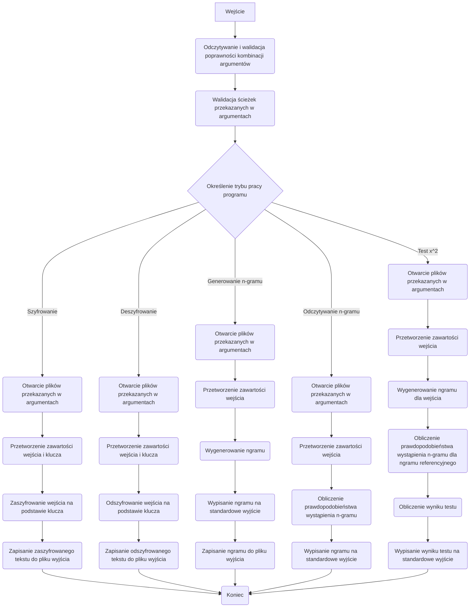

# Kryptografia i kryptoanaliza

## Laboratorium 1

### Grupa 1ID24B

### Autorzy: Jakub Babiarski, Jan Chojnacki


### Baza projektu

Działanie całego projektu opiera się na pliku ```main.rs```, który zależnie opcji i parametrów podanych przy włączaniu programu wywołuje odpowiednie funkcje. 
Poniżej przedstawiono kod źródłowy pliku main.rs oraz plików pomocniczych. Plik ten służy za bazę dla wszystkich zajęć laboratoryjnych i sukcesywnie będzie aktualizowany.
```Rust
//! Główna aplikacja CLI kierująca wywołaniami do poszczególnych modułów kryptograficznych.

mod algorithms;
mod args;
mod attack;
mod file_handling;
mod operations;
mod ngram;

use crate::algorithms::*;
use crate::args::{
    AlgorithmCommand, Args, AttackAlgorithmCommand, AttackArgs, AttackCommand, Commands,
    NgramCommand,
};
use crate::attack::*;
use clap::Parser;

/// Punkt wejścia programu odpowiedzialny za sparsowanie argumentów i delegowanie
/// wykonania do odpowiednich modułów implementujących algorytmy, operacje i ataki.
///
/// # Działanie
/// * Korzysta z `clap` do odczytania poleceń przekazanych wierszem poleceń.
/// * Na podstawie otrzymanego podpolecenia wywołuje funkcję obsługującą dany tryb
///   pracy (szyfrowanie, deszyfrowanie, analizy n-gramowe bądź ataki).
/// * Każdy wariant polecenia przekazuje dalej odpowiednie argumenty, dzięki czemu
///   logika biznesowa pozostaje odseparowana od warstwy CLI.
fn main() {
    let args = Args::parse();

    // Dopasowanie wariantu polecenia przekierowujące wykonanie do odpowiedniego modułu.
    match args.commands {
        Commands::Encrypt { algorithm_command } => match algorithm_command {
            AlgorithmCommand::Substitution { input, output, key } => {
                substitution::handle_encrypt(input, output, key);
            }
            AlgorithmCommand::Transposition { input, output, key } => {
                transposition::handle_encrypt(input, output, key);
            }
            AlgorithmCommand::Affine {
                input,
                output,
                a,
                b,
            } => {
                affine::handle_encrypt(input, output, a, b);
            }
        },
        Commands::Decrypt { algorithm_command } => match algorithm_command {
            AlgorithmCommand::Substitution { input, output, key } => {
                substitution::handle_decrypt(input, output, key);
            }
            AlgorithmCommand::Transposition { input, output, key } => {
                transposition::handle_decrypt(input, output, key);
            }
            AlgorithmCommand::Affine {
                input,
                output,
                a,
                b,
            } => {
                affine::handle_decrypt(input, output, a, b);
            }
        },
        Commands::Ngram { ngram_command } => match ngram_command {
            NgramCommand::Generate { g, input, file } => {
                operations::handle_ngram_generate(input, file, g);
            }
            NgramCommand::Read { r, file } => {
                operations::handle_ngram_read(file, r);
            }
        },
        Commands::Attack { attack_command } => match attack_command {
            AttackCommand::BruteForce { algorithm } => match algorithm {
                AttackAlgorithmCommand::Transposition { args } => {
                    let AttackArgs {
                        input,
                        output,
                        file,
                        r,
                    } = args;
                    bruteforce::transposition::handle_attack(input, output, file, r);
                }
                AttackAlgorithmCommand::Affine { args } => {
                    let AttackArgs {
                        input,
                        output,
                        file,
                        r,
                    } = args;
                    bruteforce::affine::handle_attack(input, output, file, r);
                }
            },
        },
        Commands::Similarity { r, input, file } => {
            operations::handle_x2test(input, file, r);
        }
    }
}

```
Działanie funkcji ```main.rs``` opiera się na wykorzystaniu ```match```, która działa analogicznie do słowa kluczowego ```switch``` wykorzystywanego w np. w języku c. Funkcja odczytuje argument podany przy wywołaniu programu i dopasowuje go przy pomocy struktury ```args{}``` do pasującego typu enumerate.  Funkcja nie przyjmuje argumentów oraz nie zwraca żadnych wartości.

Kod źródłowy struktury ```Args{}```. Struktura przechowuje informacje o opcjach wybranych przy uruchamianiu aplikacji. pole commands jest weryfikowane przez typ enumerate, który będzie bliżej opisany podczas omawiania zadań laboratoryjnych.
```Rust
pub struct Args {
    /// Główne polecenie wybierające tryb pracy narzędzia.
    #[command(subcommand)]
    pub commands: Commands,
}

```

Struktura

### Zadanie 1

Korzystając z języka Rust, dokonaj implementacji programu szyfrującego i deszyfrującego zadany tekst.

1. Tekst jawny powinien być importowany do programu z pliku tekstowego, którego nazwa określona powinna być
   po zdefiniowanym argumencie / fladze: -i.
2. Wynik pracy programu powinien być eksportowany do pliku tekstowego, którego nazwa określona powinna być
   po zdefiniowanym argumencie / fladze: -o.
3. Klucz powinien być importowany z pliku tekstowego, którego nazwa powinna być określona po zdefiniowanym
   argumencie / fladze: -k.
4. Tryb pracy programu powinien być określony poprzez flagi: -e dla procesu szyfrowania, -d dla procesu deszyfrowania

#### Implementacja


### Zadanie 2

Rozbudować program z poprzedniego przykładu poprzez dodanie do niego funkcjonalności generowania statystyk licz-
ności występowania n-gramów (sekwencji kolejnych liter), to jest mono-gramów (pojedynczych liter), bi-gramów (wy-
razów dwuliterowych), tri-gramów (wyrazów trzyliterowych) oraz quad-gramów (wyrazów czteroliterowych). Funk-
cjonalność ta powinna być wyzwalana poprzez dodanie do programu jednej z następujących flag: -g1, -g2, -g3 lub
-g4, po której powinna zostać określona nazwa pliku, do którego zapisane zostaną wyniki.

#### Implementacja

Kod źródłowy funkcji ```ngram_generator```

```Rust
pub fn ngram_generator(args: Args) {
    // Gather the input path, output destination and requested n-gram size.
    let input = args.input.unwrap();
    let output = args.ngram_file.unwrap();
    let ngram_size = args.mode_group.gram.unwrap();

    // Read the plaintext input and prepare the output file.
    let input = open_input(input).expect("Failed to open input file");
    let output = open_output(output).expect("Failed to open output file");

    // Normalise the plaintext prior to n-gram extraction.
    let input = input_parser(input);

    // Build the n-gram list, convert it into a histogram and serialise the result.
    let ngram = crate::generators::ngram_generator(&input, ngram_size);
    let histogram = histogram_generator(ngram);
    let buf = ngram_to_string(histogram);

    println!("{buf}");

    // Write the histogram to disk for later use.
    save_to_file(&buf, output);
}
```

- Funkcja przyjmuje w argumencie strukturę ```args{}```.
- Funkcja nie zwraca żadnych wartości.
- Funkcja w pierwszej kolejności przygotowuje dane: odpakowuje je, a następnie otwiera pliki wejścia oraz wyjścia.
  Kolejno przetwarza otwarty plik funkcją ```input_parser```
  tak, żeby zawierał jedynie duże litery alfabetu. Następnie przy pomocy funkcji ```ngram_generator()``` z modułu
  ```generators``` tworzy histogramy wystąpień n-gramów, przy pomocy funkcji ```hisogram_generator()```. Dalej zapisuje
  histogram do bufora i wypisuje go. Na końcu zapisuje wspomniany bufor do pliku wyjściowego.

Kod źródłowy funkcji ```ngram_generator()``` z modułu ```generators.rs```

```Rust
   pub fn ngram_generator(input: &str, ngram_size: u8) -> Vec<String> {
    // Slide over the bytes to capture every n-length subsequence.
    input
        .as_bytes()
        .windows(ngram_size as usize)
        .map(|w| String::from_utf8_lossy(w).to_string())
        .collect()
}
```

- Funkcja przyjmuje w argumencie odwołanie do łańcucha znaków oraz długość n-gramu.
- Funkcja zwraca wektor typu string.
- Funkcja dzieli tekst wejściowy na bity, następnie tworzy iterator po wszystkich nakładających się elementach o
  długości podanej w argumencie, kolejno konwertuje buty z powrotem na typ string, a na końcu zapisuje wyniki do
  wektora, który zwraca.

Kod źródłowy funkcji ```histogram_generator```

```Rust
pub fn histogram_generator(ngram: Vec<String>) -> Vec<(String, u64)> {
    // Count occurrences of each n-gram using a hash map accumulator.
    let mut res = ngram
        .iter()
        .fold(HashMap::new(), |mut acc, gram| {
            *acc.entry(gram.clone()).or_insert(0) += 1;
            acc
        })
        // Move the aggregated counts into a vector to preserve ordering requirements.
        .iter()
        .fold(Vec::new(), |mut acc, (k, v)| {
            acc.push((k.clone(), *v));
            acc
        });

    // Sort the histogram by frequency in descending order.
    res.sort_by_key(|&(_, v)| v);
    res.reverse();

    res
}

```

- Funkcja przyjmuje w argumencie wektor typu string wygenerowany przez funkcję ``crate::generators::ngram_generator``.
- Funkcja zwraca wektor zawierający parę wartości, string z n-gramem oraz ilość jego wystąpień w analizowanym tekście.
- Funkcja iteruje po wektorze n-gramów, jeśli napotkany element nie istniał, dodaje go do mapy i ustawia licznik na
  zero, następnie zwiększa licznik o 1 z każdym wystąpieniem elementu.
  Dalej konwertuje mapę na wektor. Na końcu sortuje wartości w wekotrze od największej do najmniejszej i zwraca go.

Kod źródłowy funkcji ```ngram_to_string```

```Rust
pub fn ngram_to_string<T: Display>(input: Vec<(String, T)>) -> String {
   // Format each entry as "GRAM: VALUE" and concatenate the lines into a single string.
   input
           .iter()
           .map(|(k, v)| format!("{k}: {v}"))
           .collect::<Vec<_>>()
           .join("\n")
}
```

- Funkcja przyjmuje w argumencie wektor pary wartości typu string i generycznego typu T.
- Funkcja zwraca wartość typu string.
- Funkcja zamienia wektor zawierający n-gramy na wartość typu string. Następnie łączy wszystkie wartości w jednolity
  tekst, gdzie każdy n-gram jest zapisany w osobnej linii, wraz z ilością jego wystąpień.

#### Wyniki

Działanie programu do generowania n-gramów. W tym przypadku w argumencie wpisano liczbę 2.

```sh

./target/debug/Cryptography-and-cryptanalysis -g2 -i alice_wonderland.txt 2-grams.txt 
HE 4041
TH 4040
ER 2300
IN 2284
AN 1804
OU 1720
IT 1536
ND 1450
AT 1409
RE 1404


```

Wyniki powinny być zinterpretowane.

### Zadanie 3

Uzupełnij program z poprzedniego zadania, tak aby w przypadku podania flagi -rX, gdzie X jest liczbą należącą do
zbioru {1, 2, 3, 4} a następnie nazwy pliku, program odczytywał z niego referencyjną bazę n-gramów. Liczby z
podanego zbioru odpowiadają: {mono-gramom, bi-gramom, tri-gramom, quad-gramom}.

Następnie należy rozbudować program, tak aby podanie flagi -s generowało wartość testu χ2 dla zadanego tekstu (flaga
-i) i wybranej bazy referencyjnej (flaga -rX). Wynik działania programu powinien być drukowany na standardowe
wyjście.

#### Implementacja

Kod źródłowy funkcji ```ngram_reader```.

```Rust
pub fn ngram_reader(args: Args) {
    // Retrieve the histogram path and its associated n-gram size.
    let input = args.ngram_file.unwrap();
    let ngram_size = args.mode_group.read_ngram.unwrap();

    // Load and parse the histogram file to recover its probability distribution.
    let ngram = open_ngram(input).expect("Failed to open ngram file");

    let ngram = ngram_parser(ngram, ngram_size);

    println!("{}", ngram_to_string(ngram));
}
```

- Funkcja przyjmuje w argumencie ścieżkę do pliku z zapisanym histogramem n-gramów oraz ich rozmiar.
- Funkcja nic nie zwraca.
- Funkcja w pierwszej kolejności wczytuje informacje o n-gramach: ścieżkę do pliku oraz wielkość n-gramu. Następnie
  otwiera ngram i przy pomocy funkcji ```ngram_parser``` oblicza prawdopodobieństwo wystąpienia n-gramu, a następnie
  wypisuje go.

Kod źródłowy funkcji ```ngram_parser```.

```Rust
pub fn ngram_parser(ngram: File, n: u8) -> Vec<(String, f64)> {
    let mut map: Vec<(String, u64)> = Vec::new();
    let reader = BufReader::new(ngram);

    let mut sum: u64 = 0;

    for line in reader.lines() {
        if let Ok(line) = line {
            let parts: Vec<&str> = line.split_whitespace().collect();
            if parts.len() != 2 {
                panic!("Invalid ngram format.")
            }
            let key = parts[0].to_string();
            let value = u64::from_str(parts[1]).unwrap();
            if key.len() != n as usize {
                dbg!(key);
                panic!("Invalid ngram format.")
            }

            // Track the raw occurrence count before normalising to probabilities.
            map.push((key, value));
            sum += value;
        }
    }

    // Convert each raw count to a probability using the total number of observations.
    map.iter()
        .map(|(k, v)| (k.clone(), *v as f64 / sum as f64))
        .collect()
}
```

- Funkcja przyjmuje otwarty plik z n-gramami.
- Funcka zwraca wektor pary n-gram i prawdopodobieństwo jego wystąpienia.
- Funkcja iteruje po wektorze zliczając ilość wszystkich n-gramów, a następnie oblicza prawdopodobieństwo dla każdego
  n-gramu występującego w tekście.

#### Wyniki

```sh

./target/debug/Cryptography-and-cryptanalysis -r2 2-grams.txt
HE 0.032762828256621884
TH 0.03275472065249998
ER 0.018647489480383653
IN 0.018517767814433157
AN 0.014626117835918308
OU 0.013945079089678208
IT 0.012453279931247518
ND 0.011756025976763607
AT 0.011423614207765463
RE 0.011383076187155934


```

Program poprawnie wypisuje prawdopodobieństwo wystąpienia n-gramu w pliku.

```Rust
pub fn x2test(args: Args) {
    // Obtain the ciphertext path, reference histogram and the n-gram size used for comparison.
    let input = args.input.unwrap();
    let ngram_ref = args.ngram_file.unwrap();
    let ngram_size = args.mode_group.read_ngram.unwrap();

    // Parse the ciphertext and compute its histogram for the requested n-gram length.
    let input = open_input(input).expect("Failed to open input file");

    let input = input_parser(input);
    let ngram = crate::generators::ngram_generator(&input, ngram_size);
    let ngram = histogram_generator(ngram);

    // Load the reference histogram used as the expected distribution.
    let ngram_ref = open_ngram(ngram_ref).expect("Failed to open ngram file");
    let ngram_ref = ngram_parser(ngram_ref, ngram_size);

    let mut sum: f64 = 0.0;

    // Total number of observed n-grams in the analysed text.
    let n: u64 = ngram.iter().map(|(_, num)| num).sum();

    // Apply the chi-squared formula across each n-gram observation.
    for i in 0..ngram.len() {
        let e = ngram_ref[i].1 * n as f64;
        sum += (ngram[i].1 as f64 - e).powi(2) / e
    }

    // Output the resulting chi-squared statistic for downstream analysis.
    println!("{sum:.20}")
}
```

- Funkcja przyjmuje za argumenty strukturę, wykorzystuje z niej ścieżkę do pliku tekstu wejściowego, ścieżkę do pliku
  zawierającego n-gramy oraz jego rozmiar.
- Funkcja nic nie zwraca.
- Funkcja przygotowuje pliki do analizy, otwiera je i usuwa zbędne znaki (np. spacje) i skleja całość w jeden ciąg
  znaków. Następnie tworzy z tego pliku histogram n-gramów, który porównuje z histogramem podanym w argumencie funkcji.
  Następnie oblicza wartość testu x^2 dla podanych plików.

```shell

./target/debug/Cryptography-and-cryptanalysis -s -i alice_wonderland.txt -r2 2-grams.txt
0.00000000000000000000

```

Program poprawnie porównuje n-gram z plikiem tekstu jawnego. Wynik 0 oznacza, że pliki są takie same, co jest prawdą,
ponieważ plik ```2-grams.txt``` został wygenerowany na podstawie pliku ```alice_wonderlands```. Poniżej przedstawiono
przykład dla n-gramu, który nie jest powiązany z plikiem źródłowym.

```shell

./target/debug/Cryptography-and-cryptanalysis -s -i fairytale.txt -r2 english_bigrams.txt 
12181.52784371924099104945

```

### Zadanie 4

- Dokonaj obserwacji wyniku testu χ2 dla tekstu jawnego i zaszyfrowanego o różnych długościach.
- Wiadomo, iż wynik testu może być znacząco zaburzony w przypadku gdy brane są pod uwagę symbole (n-gramy),
  które rzadko występują w tekście, np w przypadku mono-gramów języka angielskiego są to litery: J, K, Q, X oraz
  Z (patrz odczytana tablica częstości mono-gramów). Zbadaj wynik testu χ2 w przypadku gdy do wyznaczenia
  testu pominięte zostaną rzadko występujące n-gramy

#### Wyniki

Wyniki

```sh

./target/debug/Cryptography-and-cryptanalysis -s -i alice_wonderland.txt -r2 2-grams.txt
0.00000000000000000000

./target/debug/Cryptography-and-cryptanalysis -s -i fairytale.txt -r2 english_bigrams.txt 
12181.52784371924099104945

./target/debug/Cryptography-and-cryptanalysis -s -i alice_wonderland.txt -r1 english_monograms.txt 
599.09697433246287801012
```

```sh

./target/debug/Cryptography-and-cryptanalysis -s -i alice_wonderland.txt -r2 english_bigrams.txt 
1210.95027642850368465588

./target/debug/Cryptography-and-cryptanalysis -s -i AWout.txt -r2 english_bigrams.txt 
1210.95027642850368465588

./target/debug/Cryptography-and-cryptanalysis -s -i AWout.txt -r2 Reduced_bigrams.txt 
1210.92697753112520331342

./target/debug/Cryptography-and-cryptanalysis -s -i alice_wonderland.txt -r2 Reduced_bigrams.txt 
1210.92697753112520331342

```

```sh

./target/debug/Cryptography-and-cryptanalysis -s -i alice_wonderland.txt -r3 english_trigrams.txt 
3102.87288484137070554425

./target/debug/Cryptography-and-cryptanalysis -s -i alice_wonderland.txt -r3 Reduced_trigrams.txt 
3102.81211819119334904826

./target/debug/Cryptography-and-cryptanalysis -s -i AWout.txt -r3 Reduced_trigrams.txt 
3102.81211819119334904826

./target/debug/Cryptography-and-cryptanalysis -s -i AWout.txt -r3 english_trigrams.txt 
3102.87288484137070554425
```

```sh

./target/debug/Cryptography-and-cryptanalysis -s -i alice_wonderland.txt -r4 english_quadgrams.txt 
6380.06156763081344251987

./target/debug/Cryptography-and-cryptanalysis -s -i AWout.txt -r4 english_quadgrams.txt 
6380.06156763081344251987

./target/debug/Cryptography-and-cryptanalysis -s -i alice_wonderland.txt -r4 Reduced_quadgrams.txt 
6380.02816471075766457943

./target/debug/Cryptography-and-cryptanalysis -s -i AWout.txt -r4 Reduced_quadgrams.txt 
6380.02816471075766457943


```

Wyniki funkcji x^2 dla tekstu jawnego oraz odpowiadającego mu tekstu zaszyfrowanego są takie same, skrócenie n-gramów
zmniejsza wynik.
