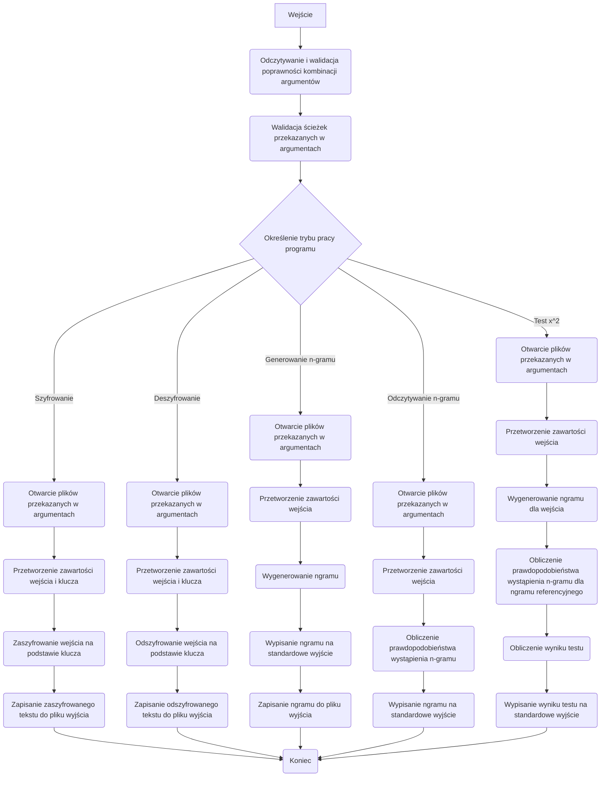

# Kryptografia i kryptoanaliza

## Laboratorium 1

### Grupa 1ID24B

### Autorzy: Jakub Babiarski, Jan Chojnacki


### Baza projektu

Działanie całego projektu opiera się na pliku ```main.rs```, który zależnie opcji i parametrów podanych przy włączaniu programu wywołuje odpowiednie funkcje. 
Poniżej przedstawiono kod źródłowy pliku main.rs oraz plików pomocniczych. Plik ten służy za bazę dla wszystkich zajęć laboratoryjnych i sukcesywnie będzie aktualizowany.
```Rust
//! Główna aplikacja CLI kierująca wywołaniami do poszczególnych modułów kryptograficznych.

mod algorithms;
mod args;
mod attack;
mod file_handling;
mod operations;
mod ngram;

use crate::algorithms::*;
use crate::args::{
    AlgorithmCommand, Args, AttackAlgorithmCommand, AttackArgs, AttackCommand, Commands,
    NgramCommand,
};
use crate::attack::*;
use clap::Parser;

/// Punkt wejścia programu odpowiedzialny za sparsowanie argumentów i delegowanie
/// wykonania do odpowiednich modułów implementujących algorytmy, operacje i ataki.
///
/// # Działanie
/// * Korzysta z `clap` do odczytania poleceń przekazanych wierszem poleceń.
/// * Na podstawie otrzymanego podpolecenia wywołuje funkcję obsługującą dany tryb
///   pracy (szyfrowanie, deszyfrowanie, analizy n-gramowe bądź ataki).
/// * Każdy wariant polecenia przekazuje dalej odpowiednie argumenty, dzięki czemu
///   logika biznesowa pozostaje odseparowana od warstwy CLI.
fn main() {
    let args = Args::parse();

    // Dopasowanie wariantu polecenia przekierowujące wykonanie do odpowiedniego modułu.
    match args.commands {
        Commands::Encrypt { algorithm_command } => match algorithm_command {
            AlgorithmCommand::Substitution { input, output, key } => {
                substitution::handle_encrypt(input, output, key);
            }
            AlgorithmCommand::Transposition { input, output, key } => {
                transposition::handle_encrypt(input, output, key);
            }
            AlgorithmCommand::Affine {
                input,
                output,
                a,
                b,
            } => {
                affine::handle_encrypt(input, output, a, b);
            }
        },
        Commands::Decrypt { algorithm_command } => match algorithm_command {
            AlgorithmCommand::Substitution { input, output, key } => {
                substitution::handle_decrypt(input, output, key);
            }
            AlgorithmCommand::Transposition { input, output, key } => {
                transposition::handle_decrypt(input, output, key);
            }
            AlgorithmCommand::Affine {
                input,
                output,
                a,
                b,
            } => {
                affine::handle_decrypt(input, output, a, b);
            }
        },
        Commands::Ngram { ngram_command } => match ngram_command {
            NgramCommand::Generate { g, input, file } => {
                operations::handle_ngram_generate(input, file, g);
            }
            NgramCommand::Read { r, file } => {
                operations::handle_ngram_read(file, r);
            }
        },
        Commands::Attack { attack_command } => match attack_command {
            AttackCommand::BruteForce { algorithm } => match algorithm {
                AttackAlgorithmCommand::Transposition { args } => {
                    let AttackArgs {
                        input,
                        output,
                        file,
                        r,
                    } = args;
                    bruteforce::transposition::handle_attack(input, output, file, r);
                }
                AttackAlgorithmCommand::Affine { args } => {
                    let AttackArgs {
                        input,
                        output,
                        file,
                        r,
                    } = args;
                    bruteforce::affine::handle_attack(input, output, file, r);
                }
            },
        },
        Commands::Similarity { r, input, file } => {
            operations::handle_x2test(input, file, r);
        }
    }
}

```
Działanie funkcji ```main.rs``` opiera się na wykorzystaniu ```match```, która działa analogicznie do słowa kluczowego ```switch``` wykorzystywanego w np. w języku c. Funkcja odczytuje argument podany przy wywołaniu programu i dopasowuje go przy pomocy struktury ```args{}``` do pasującego typu enumerate.  Funkcja nie przyjmuje argumentów oraz nie zwraca żadnych wartości.

Kod źródłowy struktury ```Args{}```. Struktura przechowuje informacje o opcjach wybranych przy uruchamianiu aplikacji. pole commands jest weryfikowane przez typ enumerate, który będzie bliżej opisany podczas omawiania zadań laboratoryjnych.
```Rust
pub struct Args {
    /// Główne polecenie wybierające tryb pracy narzędzia.
    #[command(subcommand)]
    pub commands: Commands,
}
```
W programie został również zaimplementowana pomoc, która ułatwa obsługę. Poniżej przedstawiono przykładowe wywołanie programu korzystając z pomocy.
```shell

jakubbabiarski@fedora:~/RustroverProjects/Cryptography-and-cryptanalysis$ ./target/debug/Cryptography-and-cryptanalysis
Parametry wiersza poleceń kontrolujące działanie aplikacji

Usage: Cryptography-and-cryptanalysis <COMMAND>

Commands:
  encrypt     Szyfrowanie tekstu za pomocą wybranego algorytmu klasycznego
  decrypt     Deszyfrowanie tekstu za pomocą wybranego algorytmu klasycznego
  ngram       Operacje na statystykach n-gramowych
  attack      Uruchomienie ataków kryptograficznych typu brute force
  similarity  Porównanie podobieństwa rozkładu tekstu wejściowego z referencyjnym
  help        Print this message or the help of the given subcommand(s)

Options:
  -h, --help     Print help
  -V, --version  Print version
jakubbabiarski@fedora:~/RustroverProjects/Cryptography-and-cryptanalysis$ ./target/debug/Cryptography-and-cryptanalysis enc
Szyfrowanie tekstu za pomocą wybranego algorytmu klasycznego

Usage: Cryptography-and-cryptanalysis encrypt <COMMAND>

Commands:
  substitution   Algorytm podstawieniowy z kluczem dostarczonym w pliku
  transposition  Algorytm przestawieniowy z przesunięciem klucza
  affine         Algorytm afiniczny z parametrami multiplikatywnym i addytywnym
  help           Print this message or the help of the given subcommand(s)

Options:
  -h, --help  Print help
jakubbabiarski@fedora:~/RustroverProjects/Cryptography-and-cryptanalysis$ ./target/debug/Cryptography-and-cryptanalysis enc sub
error: the following required arguments were not provided:
  --input <INPUT>
  --output <OUTPUT>
  --key <KEY>

Usage: Cryptography-and-cryptanalysis encrypt substitution --input <INPUT> --output <OUTPUT> --key <KEY>

For more information, try '--help'.
jakubbabiarski@fedora:~/RustroverProjects/Cryptography-and-cryptanalysis$ ./target/debug/Cryptography-and-cryptanalysis enc sub -i ./plaintext/alice_wonderland.txt -o ./outputfile/zadanie1.txt -k key.txt 

```
Struktura

### Zadanie 1

Korzystając z języka Rust, dokonaj implementacji programu szyfrującego i deszyfrującego zadany tekst.

1. Tekst jawny powinien być importowany do programu z pliku tekstowego, którego nazwa określona powinna być
   po zdefiniowanym argumencie / fladze: -i.
2. Wynik pracy programu powinien być eksportowany do pliku tekstowego, którego nazwa określona powinna być
   po zdefiniowanym argumencie / fladze: -o.
3. Klucz powinien być importowany z pliku tekstowego, którego nazwa powinna być określona po zdefiniowanym
   argumencie / fladze: -k.
4. Tryb pracy programu powinien być określony poprzez flagi: -e dla procesu szyfrowania, -d dla procesu deszyfrowania

#### Implementacja
Fragment funkcji ```main.rs``` odpowiedzialnej za wywołanie funkcjonalności określonej w zadaniu 1.
```Rust
fn main() {
    let args = Args::parse();

    // Dopasowanie wariantu polecenia przekierowujące wykonanie do odpowiedniego modułu.
    match args.commands {
        Commands::Encrypt { algorithm_command } => match algorithm_command {
            AlgorithmCommand::Substitution { input, output, key } => {
                substitution::handle_encrypt(input, output, key);
            }
        }
        Commands::Decrypt { algorithm_command } => match algorithm_command {
            AlgorithmCommand::Substitution { input, output, key } => {
                substitution::handle_decrypt(input, output, key);
            }
        }
    }
}
```
Ten fragment dopasowuje opcje opraz argumenty podane przy wywołaniu do wartości zapisanych w typie enumarate. Poniżej fragment kodu tupy enumerate ```Commands```.

```Rust
#[derive(Subcommand, Debug)]
#[command(infer_subcommands = true)]
pub enum Commands {
    /// Szyfrowanie tekstu za pomocą wybranego algorytmu klasycznego.
    Encrypt {
        /// Podpolecenie określające algorytm i jego parametry.
        #[command(subcommand)]
        algorithm_command: AlgorithmCommand,
    },
    /// Deszyfrowanie tekstu za pomocą wybranego algorytmu klasycznego.
    Decrypt {
        /// Podpolecenie określające algorytm i jego parametry.
        #[command(subcommand)]
        algorithm_command: AlgorithmCommand,
    },
}
```
Typ przechowuje informacje co robić, jeśli w argumencie będzie podana opcja ```Encrypt``` i ```Decrypt```, które określają jaką funkcjonalość ma spełnić program w danej chwili. W obu przypadkach typ pobiera dane z kolejnego typu enumerate.

Fragment kodu typu enmumerate ```AlgorithmCommand```
```Rust
/// Wybór algorytmów szyfrowania i ich parametrów.
#[derive(Subcommand, Debug)]
pub enum AlgorithmCommand {
    /// Algorytm podstawieniowy z kluczem dostarczonym w pliku.
    Substitution {
        /// Plik z tekstem jawnym lub zaszyfrowanym.
        #[arg(short, long)]
        input: PathBuf,
        /// Plik wyjściowy na wynik szyfrowania bądź deszyfrowania.
        #[arg(short, long)]
        output: PathBuf,
        /// Plik z mapowaniem znaków stanowiącym klucz podstawienia.
        #[arg(short, long)]
        key: PathBuf,
    },
}
```
Typ ten określa jakie argumenty należy podać przy uruchamianiu programu. W tym wypadku jest to plik wejściowy z tekstem, plik wyjściowy z tekstem zmienionym oraz plik klucza, na którego podstawie tekst wejściowy będzie odpowiednio szyfrowany, lub odszyfrowywany.
Na podstawie powyższych typów enumerate wybierana jest funkcja, która ma się wykonać. Możliwe są 2 wywołania.
1. Wywołanie funkcji ```handle_encrypt()```
```Rust
pub fn handle_encrypt(input: PathBuf, output: PathBuf, key: PathBuf) {
  let input = open_input(input).expect("Failed to open input file");
  let output = open_output(output).expect("Failed to open output file");
  let key = open_key(key).expect("Failed to open key file");

  let input = input_parser(input);
  let key = key_parser(key, false);

  let buf: String = substitute(&input, &key);

  save_to_file(&buf, output);
} 
```

2. Wywołanie funkcji ```handle_decrypt()```
```Rust
pub fn handle_decrypt(input: PathBuf, output: PathBuf, key: PathBuf) {
    let input = open_input(input).expect("Failed to open input file");
    let output = open_output(output).expect("Failed to open output file");
    let key = open_key(key).expect("Failed to open key file");

    let input = input_parser(input);
    let key = key_parser(key, true);

    let buf: String = substitute(&input, &key);

    save_to_file(&buf, output);
}
```

Obie funkcje przyjmują w argumencie ścieżki do pliku wejściowego, wyjściowego oraz klucza. Wszystkie te ścieżki są przekazywane przy wywołaniu programu.
W pierwszej kolejności funkcje otwierają wskazane pliki, następnie wywołują funkcje pomocnicze: ```input_parser()``` i ```key_parser()``` w celu przygotowania tekstu. Na końcu zapisują wynik funkcji pomocniczej ```substitute``` to bufora, ktory zapisuje wynik do pliku wyjściowego. Funkcja nie zwraca żadnych wartości.
Obie funkcje różnią się jedynie argumentem przekazywanym do funkcji pomocniczej ```key_parser```, której kod przedstawiono poniżej.
```Rust
pub fn key_parser(key: File, decryption: bool) -> HashMap<char, char> {
    let mut map: HashMap<char, char> = HashMap::new();
    let reader = BufReader::new(key);

    for line in reader.lines() {
        if let Ok(line) = line {
            let parts: Vec<&str> = line.split_whitespace().collect();
            if parts.len() != 2 {
                panic!("Invalid key format.")
            }
            match decryption {
                false => {
                    let key = parts[0].chars().next().unwrap();
                    let value = parts[1].chars().next().unwrap();
                    map.insert(key, value);
                }
                true => {
                    let key = parts[1].chars().next().unwrap();
                    let value = parts[0].chars().next().unwrap();
                    map.insert(key, value);
                }
            }
        }
    }

    let key_test: HashSet<char> = map.iter().map(|(&k, _)| k).collect();
    let value_test: HashSet<char> = map.iter().map(|(_, &v)| v).collect();

    if key_test.len() != 26 || value_test.len() != 26 {
        panic!("Invalid key values.")
    }

    map
}
```
Funkcja przyjmuje strukturę ```File``` zawierającą informacje o otwartym pliku oraz wartość binarną ```decrytpion``` odpowiedzialną za wybór operacji. W pierwszej kolejności tworzy mapę znaków, następnie zależnie od wartości binarnej przypisuje odpowiednie znaki. Jeśli wartość ```decryption``` jest ustawiona na false, zostaną wczytane znaki z klucza służące do szyfrowania tekstu, jeśli wartość będzie ustawiona na true, zostaną wczytane znaki służące do odszyfrowywania.
Następnie sprawdzana jest poprawność działania, a na końcu funkcja zwraca nowo utworzoną mapę.
Następną funkcją wywoływaną w funkcjach obsługujących szyfrowanie i odszyfrowanie jest funkcja ```input_parser```, której kod zaprezentowano poniżej.

```Rust
pub fn input_parser(input: File) -> String {
    let reader = BufReader::new(input);
    let mut buf: Vec<String> = Vec::new();

    for line in reader.lines() {
        if let Ok(line) = line {
            let filtered_string: String =
                line.chars().filter(|c| c.is_ascii_alphabetic()).collect();
            buf.push(filtered_string.to_uppercase())
        }
    }

    buf.join("")
}
```
Funkcja przyjmuje w argumencie strukturę zawierającą informacje dotyczące otwartego pliku, następnie tworzy wektor łańcuhca znaków i iteruje po nim zapisując jedynie znaki alfabetu angielskiego, które zamienia na wielkie litery, następnie zapisuje je w buforze i zwraca cały łańcuch znaków do funkcji szyfrującej.

Ostatnią funkcją pomocniczą jest funkcja ```substitute()```, której kod pokazano poniżej.

```Rust
pub fn substitute(input: &str, key: &HashMap<char, char>) -> String {
    input.chars().map(|x| key.get(&x).unwrap()).collect()
}
```
Funkcja w argumencie przyjmuje plik wejściowy przygotowany przez funkcję ```input_parser``` oraz mapę hash'y z kluczem przygotowanym przez funkcję ```key_parser```, a następnie zamienia znaki zawarte w pliku wejściowym (input) zamienia na odpowiadające znaki z klucza. 
Funkcja zwraca łancuch znaków z zamienionymi znakami.

#### Wyniki
Poniżej przedstawiono wynik działania programu z wykorzystaniem różnych plików wejściowych.
```shell

./target/debug/Cryptography-and-cryptanalysis dec sub -i ./plaintext/alice_wonderland.txt -o ./outputfile/zadanie1.txt -k key.txt 
head -c 100 ./outputfile/zadanie1.txt 
LNFDSCYFWLUMLFAHFSUFHCCRCPQOJWFTQVEFALMSFTJABCAVFSOQAVLNJTFHCCRJTPCSLNFMTFCPQAXCAFQAXBNFSFJALNFMAJLF
```
```shell

 ./target/debug/Cryptography-and-cryptanalysis enc sub -i ./outputfile/zadanie1.txt -o ./outputfile/outzadanie1.txt -k key.txt 
head -c 100 ./outputfile/outzadanie1.txt 
THEPROJECTGUTENBERGEBOOKOFALICESADVENTURESINWONDERLANDTHISEBOOKISFORTHEUSEOFANYONEANYWHEREINTHEUNITE
```

Oba przypadki działają poprawnie, program szyfruje oraz odszyfrowuje na podstawie podanych parametrów teksty. Polecenie head służy do wypisania ograniczonych do 100 znaków wyników.
### Zadanie 2

Rozbudować program z poprzedniego przykładu poprzez dodanie do niego funkcjonalności generowania statystyk licz-
ności występowania n-gramów (sekwencji kolejnych liter), to jest mono-gramów (pojedynczych liter), bi-gramów (wy-
razów dwuliterowych), tri-gramów (wyrazów trzyliterowych) oraz quad-gramów (wyrazów czteroliterowych). Funk-
cjonalność ta powinna być wyzwalana poprzez dodanie do programu jednej z następujących flag: -g1, -g2, -g3 lub
-g4, po której powinna zostać określona nazwa pliku, do którego zapisane zostaną wyniki.

#### Implementacja

Fragment kodu funkcji ```main.rs``` odpowiedzialna za generowanie statystyk.
```Rust
fn main() {
    let args = Args::parse();

    // Dopasowanie wariantu polecenia przekierowujące wykonanie do odpowiedniego modułu.
    match args.commands {
        Commands::Ngram { ngram_command } => match ngram_command {
            NgramCommand::Generate { g, input, file } => {
                operations::handle_ngram_generate(input, file, g);
            }
        }
    }
}
```
Funkcja odwołuje się do struktury ```Args{}```, która dopasowuje argumenty podane przy wywołaniu programu do typów enumerate ```Commands``` i ```NgramCommand```.
```Rust
pub enum Commands {
    Ngram {
        /// Podpolecenie definiujące rodzaj operacji na n-gramach.
        #[command(subcommand)]
        ngram_command: NgramCommand,
    },
}
```
```Rust
pub enum NgramCommand {
    /// Generuje histogram n-gramów na podstawie wejściowego tekstu.
    Generate {
        /// Rozmiar n-gramów do wygenerowania.
        #[arg(short, long, value_parser = clap::value_parser!(u8).range(1..=4))]
        g: u8,
        /// Plik z tekstem źródłowym wykorzystywanym do analizy.
        #[arg(short, long)]
        input: PathBuf,
        /// Opcjonalny plik wyjściowy na zapisane statystyki n-gramów.
        #[arg(value_name = "FILE")]
        file: Option<PathBuf>,
    },
}
```
Pierwszy typ enumerate odpowiada za włączenie programu w celu wygenerowania n-gramu, drugi odpowiada za ustawienia związane z n-gramami takie jak wielkość n-gramu, ścieżka do pliku wejściowego oraz opcjonalna ścieżka do zapisania n-gramu.

Następnie wywoływana jest funkcja ```handle_ngram_generate()```, której kod pokazano poniżej.
```Rust
pub fn handle_ngram_generate(input: PathBuf, file: Option<PathBuf>, g: u8) {
    let input = open_input(input).expect("Failed to open input file");

    let input = input_parser(input);

    let ngram = ngram_generator(&input, g);
    let histogram = histogram_generator(ngram);
    let buf = ngram_to_string(histogram);

    println!("{buf}");

    if let Some(file) = file {
        let output = open_output(file).expect("Failed to open output file");

        save_to_file(&buf, output);
    }
}
```

Funkcja przyjmuje w argumencie ścieżkę do pliku wejściowego, opcjonalną ścieżkę do pliku wyjściowego oraz wielkość n-gramu. W pierwszej kolejności funkcja otwiera plik, następnie wykorzystuje wcześniej omawianą funcję ```input_parser``` w celu przygotowania pliku, 
kolejno wywoływana jest funkcja ```ngram_generator```, która tworzy wektor n-gramów, dalej funkcja ```histogram_generator``` tworzy na tej podstawie histogram, dalej przy pomocy ```ngram_to_string``` przygotowuje histogram do wyświetlenia. Na końcu opcjonalnie można zapisać wynik do pliku.
```Rust
pub fn ngram_generator(input: &str, ngram_size: u8) -> Vec<String> {
    input
        .as_bytes()
        .windows(ngram_size as usize)
        .map(|w| String::from_utf8_lossy(w).to_string())
        .collect()
}
```

Funkcja ```ngram_generator``` przyjmuje łancuch znaków z plikiem wejściowym oraz wielkość n-gramu do wygenerowania. Przechodzi przez cały łańcuch dzieląc go na okna o wielkości ```ngram_size```
i zapisuje wynik do wektora łańcucha znaków, który zwraca.

```Rust
pub fn histogram_generator(ngram: Vec<String>) -> HashMap<String, u64> {
    ngram
        .iter()
        .fold(HashMap::<String, u64>::new(), |mut acc, gram| {
            *acc.entry(gram.clone()).or_insert(0) += 1;
            acc
        })
}
```

Funkcja ```histogram_generator``` przyjmuje w argumencie wektor łańcucha znaków zwrócony przez ```ngram_generator```. Przechodzi przez niego oraz zlicza ilość wystąpień
danego n-gramu i zapisuje wynik do mapy łańcucha znaków, oraz wartośći liczbowej. Jeśli podany n-gram pojawił się pierwszy raz, funkcja dodaje go, ustawia jego wartość na 0 i zwiększa ją o jeden.
Jeśli n-gram jest już w mapie, funkcja zwiększa wartość o jeden. Ostatecznie funkcja zwraca powstałą mapę.

```Rust
pub fn ngram_to_string<T: Display>(input: HashMap<String, T>) -> String {
    input
        .iter()
        .map(|(k, v)| format!("{k} {v}"))
        .collect::<Vec<_>>()
        .join("\n")
}
```
Ostatnia funkcja służąca do obsługi generowania n-gramów to ```ngram_to_string```, która przyjmuje w argumencie mapę zwróconą przez funkcję ```histogram_generator```. Przechodzi przez mapę, a następnie
łączy jej elementy (po jednym n-gramie i przypisanej do niego wartości-ilości wystąpień w linii) i zwraca jako łańcuch znaków.
#### Wyniki
Poniżej przedstawiono wyniki działań programu dla różnych tekstów.
```Shell

 ./target/debug/Cryptography-and-cryptanalysis ngr gen -g 2 -i ./plaintext/alice_wonderland.txt 
KQ 1
EE 648
SC 131
KM 11
YE 124
KV 4
GC 24
RM 178
EL 674
NO 699
```

```Shell

./target/debug/Cryptography-and-cryptanalysis ngr gen -g 2 -i ./plaintext/modern.txt 
CC 2
TO 94
YE 5
JA 3
DD 6
DR 15
GA 20
UD 6
AS 74
RC 4
```


### Zadanie 3

Uzupełnij program z poprzedniego zadania, tak aby w przypadku podania flagi -rX, gdzie X jest liczbą należącą do
zbioru {1, 2, 3, 4} a następnie nazwy pliku, program odczytywał z niego referencyjną bazę n-gramów. Liczby z
podanego zbioru odpowiadają: {mono-gramom, bi-gramom, tri-gramom, quad-gramom}.

Następnie należy rozbudować program, tak aby podanie flagi -s generowało wartość testu χ2 dla zadanego tekstu (flaga
-i) i wybranej bazy referencyjnej (flaga -rX). Wynik działania programu powinien być drukowany na standardowe
wyjście.

#### Implementacja

Fragment kodu funkcji ```main.rs``` obsługujący funkcjonalność odczytywania n-gramów.
```Rust
fn main() {
    let args = Args::parse();

    // Dopasowanie wariantu polecenia przekierowujące wykonanie do odpowiedniego modułu.
    match args.commands {
        Commands::Ngram { ngram_command } => match ngram_command {
            NgramCommand::Read { r, file } => {
                operations::handle_ngram_read(file, r);
            }
        }
    }
}

```

Funkcja odołuje się do struktury ```Args{}``` i typu enumerate.
```Rust
pub enum NgramCommand {
    /// Generuje histogram n-gramów na podstawie wejściowego tekstu.
    Generate {
        /// Rozmiar n-gramów do wygenerowania.
        #[arg(short, long, value_parser = clap::value_parser!(u8).range(1..=4))]
        g: u8,
        /// Plik z tekstem źródłowym wykorzystywanym do analizy.
        #[arg(short, long)]
        input: PathBuf,
        /// Opcjonalny plik wyjściowy na zapisane statystyki n-gramów.
        #[arg(value_name = "FILE")]
        file: Option<PathBuf>,
    },
}
```
Typ przechowuje informacje o wielkości n-gramu, ścieżki do pliku wejściowego oraz opcjonalnej ścieżki pliku wyjściowego.

Kod źródłowy funkcji ```handle_ngram_read```
```Rust
pub fn handle_ngram_read(file: PathBuf, r: u8) {
    let ngram = open_ngram(file).expect("Failed to open ngram file");

    let ngram = ngram_parser(ngram, r);

    println!("{}", ngram_to_string(ngram));
}
```

Funkcja przyjmuje w argumencie ścieżkę do pliku wejściowego oraz wielkość odczytywangeo ngramu. Na początku funkcja otwiera plik, następnie przy pomocy ```ngram_parser```
przygotowuje go a na końcu wypisuje go w postaci łańcucha znaków przy pomocy funkcji ```ngram_to_string```, która była opisana w zadaniu 2.
Funkcja nie zwraca żadnych argumentów.

Kod źródłowy funkcji ```ngram_parser```
```Rust
pub fn ngram_parser(ngram: File, n: u8) -> HashMap<String, f64> {
    let mut map: Vec<(String, u64)> = Vec::new();
    let reader = BufReader::new(ngram);

    let mut sum: u64 = 0;

    for line in reader.lines() {
        if let Ok(line) = line {
            let parts: Vec<&str> = line.split_whitespace().collect();
            if parts.len() != 2 {
                panic!("Invalid ngram format.")
            }
            let key = parts[0].to_string();
            let value = u64::from_str(parts[1]).unwrap();
            if key.len() != n as usize {
                dbg!(key);
                panic!("Invalid ngram format.")
            }

            map.push((key, value));
            sum += value;
        }
    }

    map.iter()
        .map(|(k, v)| (k.clone(), *v as f64 / sum as f64))
        .collect()
}
```

Funkcja przyjmuje w argumencie ngram oraz jego wielkość. Następnie tworzony jest wektor map do tymczasowego przechowywania wartości.
Kolejno funkcja przechodzi przez cały plik, dzieląc go po białych znakach. Dalej funkcja zlicza ilość wystąpień danego n-gramu oraz sumuje ilość wszystkich n-gramów.
Na końcu dla każdego n-gramu jest wyliczane prawdopodobieństwo jego wystąpienia.

Drugą częścią tego zadania była implementacja obliczania wartości x^2 dla pliku z tekstem oraz pliku z ngramami.

Fragment kodu funkcji ```main.rs``` obsługujący test x^2.
```Rust
fn main() {
    let args = Args::parse();
    match args.commands {
        Commands::Similarity {
            r,
            input,
            file,
            skip_infrequent,
        } => {
            operations::handle_x2test(input, file, r, skip_infrequent);
        }
    }
}
```
```rust
pub fn handle_x2test(input: PathBuf, file: PathBuf, r: u8, skip_infrequent: bool) {
    let input = open_input(input).expect("Failed to open input file");

    let input = input_parser(input);
    let ngram = ngram_generator(&input, r);
    let ngram = histogram_generator(ngram);

    let ngram_ref = open_ngram(file).expect("Failed to open ngram file");
    let ngram_ref = ngram_parser(ngram_ref, r);

    let mut x2: f64 = 0.0;

    let n: u64 = ngram.values().sum();

    for (k, v) in ngram {
        if skip_infrequent && v < 5 {
            continue
        }
        if let Some(rv) = ngram_ref.get(&k) {
            let e = rv * n as f64;
            x2 += (v as f64 - e).powi(2) / e;
        }
    }

    let df = 26.0f64.powi(r as i32) - 1.0;

    let chi = ChiSquared::new(df).expect("invalid degrees of freedom");

    let critical = chi.inverse_cdf(0.95f64);

    let reject_h0 = x2 >= critical;

    println!(
        "chi2_stat={:.12}, df={}, critical={:.12}, reject_H0={}",
        x2, df as u64, critical, reject_h0
    );
}
```
Funkcja przyjmuje w argumencie ścieżkę do pliku wejściowego, ścieżkę do plkiu zawierającego n-gram, wielkość n-gramu oraz wartość binarną odpowiedzialną za pomijanie ngramów o niskiej częstotliwości występowania.
W pierwszej kolejności funkcja otwiera i przygotowuje plik wejściowy do dalszej analizy, następnie otwiera i przygotowuje plik z n-gramem. Kolejno oblicza wartość
x^2 dla podanych plików. Na koniec funkcja wyświetla obliczoną wartość. Funkcja nie zwraca wartości.

#### Wyniki
Stary tekst.
```shell

./target/debug/Cryptography-and-cryptanalysis s  -r2 -i ./plaintext/alice_wonderland.txt ./n-grams/english_bigrams.txt 
chi2_stat=16707.628274996852, df=675, critical=736.551271135692, reject_H0=true
```
Nowy tekst.
```shell

./target/debug/Cryptography-and-cryptanalysis s  -r2 -i ./plaintext/modern.txt ./n-grams/english_bigrams.txt 
chi2_stat=1152.501001489355, df=675, critical=736.551271135692, reject_H0=true
```
n-gram wygenerowany na podstawie badanego tekstu.
```shell

./target/debug/Cryptography-and-cryptanalysis sim -r 2 -i ./plaintext/modern.txt ./outputfile/modernout.txt 
chi2_stat=0.000000000000, df=675, critical=736.551271135692, reject_H0=false
```
Program działa poprawnie. Warto zaznaczyć, że wynik testu x^2 dla tekstu pisanego dzisiejszym językiem jest niższszy niż dla testu używającego starego słownictwa, co oznacza, że tekst nowożytny bardziej pokrywa się zpodanym n-gramem.
Dodatkowe watości wypisywane przez program są wykorzystywane w laboratorium 2. Są to liczba stopni swobody, wartość krytyczna dla poziomu 0.95 oraz wartość binarna określająca czy tekst znacząco różni się od wzorca.
### Zadanie 4

- Dokonaj obserwacji wyniku testu χ2 dla tekstu jawnego i zaszyfrowanego o różnych długościach.
- Wiadomo, iż wynik testu może być znacząco zaburzony w przypadku gdy brane są pod uwagę symbole (n-gramy),
  które rzadko występują w tekście, np w przypadku mono-gramów języka angielskiego są to litery: J, K, Q, X oraz
  Z (patrz odczytana tablica częstości mono-gramów). Zbadaj wynik testu χ2 w przypadku gdy do wyznaczenia
  testu pominięte zostaną rzadko występujące n-gramy
  Stary tekst.
#### Przykładowe wyniki
```shell

./target/debug/Cryptography-and-cryptanalysis s  -r2 -i ./plaintext/alice_wonderland.txt ./n-grams/english_bigrams.txt 
chi2_stat=16707.628274996852, df=675, critical=736.551271135692, reject_H0=true
```
Nowy tekst.
```shell

./target/debug/Cryptography-and-cryptanalysis s  -r2 -i ./plaintext/modern.txt ./n-grams/english_bigrams.txt 
chi2_stat=1152.501001489355, df=675, critical=736.551271135692, reject_H0=true
```
n-gram wygenerowany na podstawie badanego tekstu.
```shell

./target/debug/Cryptography-and-cryptanalysis sim -r 2 -i ./plaintext/modern.txt ./outputfile/modernout.txt 
chi2_stat=0.000000000000, df=675, critical=736.551271135692, reject_H0=false
```
#### Wyniki dla monogramów
```shell

./target/debug/Cryptography-and-cryptanalysis  sim -r 1 -i ./plaintext/alice_wonderland.txt ./n-grams/english_monograms.txt 
chi2_stat=2610.453508530805, df=25, critical=37.652484133483, reject_H0=true

./target/debug/Cryptography-and-cryptanalysis  sim -r 1 -i ./plaintext/modern.txt ./n-grams/english_monograms.txt 
chi2_stat=149.852351582356, df=25, critical=37.652484133483, reject_H0=true

./target/debug/Cryptography-and-cryptanalysis  sim -r 1 -i ./plaintext/modern2.txt ./n-grams/english_monograms.txt 
chi2_stat=31.788779765793, df=25, critical=37.652484133483, reject_H0=false

./target/debug/Cryptography-and-cryptanalysis  sim -r 1 -i ./plaintext/modern3.txt ./n-grams/english_monograms.txt 
chi2_stat=71.354728599280, df=25, critical=37.652484133483, reject_H0=true

```

#### Wyniki dla bigramów
```shell

./target/debug/Cryptography-and-cryptanalysis  sim -r 2 -i ./plaintext/alice_wonderland.txt ./n-grams/english_bigrams.txt
chi2_stat=16707.628274996849, df=675, critical=736.551271135692, reject_H0=true

./target/debug/Cryptography-and-cryptanalysis  sim -r 2 -i ./plaintext/modern.txt ./n-grams/english_bigrams.txt 
chi2_stat=1152.501001489355, df=675, critical=736.551271135692, reject_H0=true

./target/debug/Cryptography-and-cryptanalysis  sim -r 2 -i ./plaintext/modern2.txt ./n-grams/english_bigrams.txt 
chi2_stat=515.232519752722, df=675, critical=736.551271135692, reject_H0=false

./target/debug/Cryptography-and-cryptanalysis  sim -r 2 -i ./plaintext/modern3.txt ./n-grams/english_bigrams.txt 
chi2_stat=632.509204872693, df=675, critical=736.551271135692, reject_H0=false

```
#### Wyniki dla trigramów
```shell

./target/debug/Cryptography-and-cryptanalysis  sim -r 3 -i ./plaintext/alice_wonderland.txt ./n-grams/english_trigrams.txt
chi2_stat=125110.842260517835, df=17575, critical=17884.515475316402, reject_H0=true

./target/debug/Cryptography-and-cryptanalysis  sim -r 3 -i ./plaintext/modern.txt ./n-grams/english_trigrams.txt
chi2_stat=10230.183787586455, df=17575, critical=17884.515475316402, reject_H0=false

./target/debug/Cryptography-and-cryptanalysis  sim -r 3 -i ./plaintext/modern2.txt ./n-grams/english_trigrams.txt
chi2_stat=6626.021666341579, df=17575, critical=17884.515475316402, reject_H0=false

./target/debug/Cryptography-and-cryptanalysis  sim -r 3 -i ./plaintext/modern3.txt ./n-grams/english_trigrams.txt
chi2_stat=7809.871391606195, df=17575, critical=17884.515475316402, reject_H0=false

```
#### Wyniki dla quadgramów
```shell

./target/debug/Cryptography-and-cryptanalysis  sim -r 4 -i ./plaintext/alice_wonderland.txt ./n-grams/english_quadgrams.txt
chi2_stat=1393987.801391543588, df=456975, critical=458548.624291300424, reject_H0=true

/target/debug/Cryptography-and-cryptanalysis  sim -r 4 -i ./plaintext/modern.txt ./n-grams/english_quadgrams.txt
chi2_stat=131411.971595547599, df=456975, critical=458548.624291300424, reject_H0=false

./target/debug/Cryptography-and-cryptanalysis  sim -r 4 -i ./plaintext/modern2.txt ./n-grams/english_quadgrams.txt
chi2_stat=81603.354101437217, df=456975, critical=458548.624291300424, reject_H0=false

./target/debug/Cryptography-and-cryptanalysis  sim -r 4 -i ./plaintext/modern3.txt ./n-grams/english_quadgrams.txt
chi2_stat=97821.613627252082, df=456975, critical=458548.624291300424, reject_H0=false
```
#### Porównanie tekstów na przestrzeni lat
```shell

./target/debug/Cryptography-and-cryptanalysis  sim -r 2 -i ./plaintext/alice_wonderland.txt ./n-grams/english_bigrams.txt
chi2_stat=16707.628274996849, df=675, critical=736.551271135692, reject_H0=true

 ./target/debug/Cryptography-and-cryptanalysis  sim -r 2 -i ./plaintext/modern_story_text.txt ./n-grams/english_bigrams.txt
chi2_stat=39901.071129342126, df=675, critical=736.551271135692, reject_H0=true

```

```shell

./target/debug/Cryptography-and-cryptanalysis  sim -r 4 -i ./plaintext/alice_wonderland.txt ./n-grams/english_quadgrams.txt
chi2_stat=1393987.801391543588, df=456975, critical=458548.624291300424, reject_H0=true

 ./target/debug/Cryptography-and-cryptanalysis sim -r 2 -i ./outputfile/newAWout.txt ./n-grams/english_bigrams.txt 
chi2_stat=56772629.247402794659, df=675, critical=736.551271135692, reject_H0=true

./target/debug/Cryptography-and-cryptanalysis sim -r 4 -i ./outputfile/newAWout.txt ./n-grams/english_quadgrams.txt 
chi2_stat=24215101088.505325317383, df=456975, critical=458548.624291300424, reject_H0=true

./target/debug/Cryptography-and-cryptanalysis  sim -r 4 -i ./plaintext/modern_story_text.txt ./n-grams/english_quadgrams.txt
chi2_stat=7881424.411204098724, df=456975, critical=458548.624291300424, reject_H0=true

./target/debug/Cryptography-and-cryptanalysis sim -r 2 -i ./outputfile/new_storyout.txt ./n-grams/english_bigrams.txt 
chi2_stat=82451591.583299383521, df=675, critical=736.551271135692, reject_H0=true

./target/debug/Cryptography-and-cryptanalysis sim -r 4 -i ./outputfile/new_storyout.txt ./n-grams/english_quadgrams.txt 
chi2_stat=79736810002.725692749023, df=456975, critical=458548.624291300424, reject_H0=true

```
Test poprzez różnice w wyniku chi2 poprawnie rozróżnia tekst jawny od zaszyfrowanego. Wyniki dla testu zaszyfrowanego są o wiele większe niż dla tekstów jawnych, co udowadnia działanie szyfrowania. Z testu wynika, że stare teksty osiągają niższe wyniki niż teksty nowożytne, jednak to długość tekstów oraz n-gramów jest kluczowym czynnikiem.